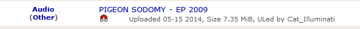
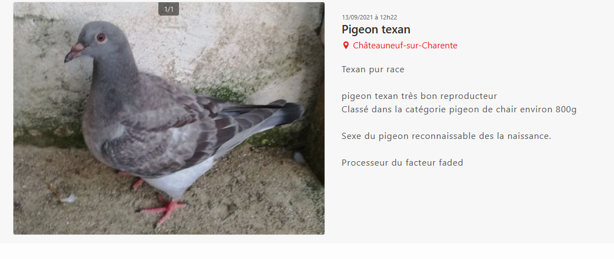
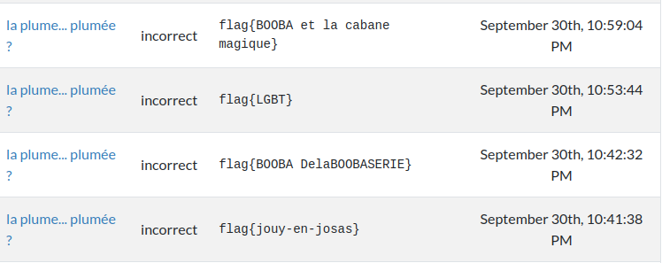

# Bêtisier

# bonus

## Meilleur commu

Pour meilleure communauté, nous avons eu surtout des gens qui ne connaissaient pas forcément OSINT-FR et/ou qui avaient oublié comment se décrivait le format du flag :

  
  

Et quelques propositions que j'aimerais bien qu'on m'explique :
  
  
  
*(non, définitivement, [ctfd](https://ctfd.io/) n'est pas une communauté je pense)*

## Formulaire AB28 à rendre

Ici, beaucoup de gens ont eu du mal à comprendre le format, les flags avaient souvent un format comme `flag{BGJTMBJGDTG}` (pas le bon nombre de lettre) ou `flag{BDJCMEIDHTD}` (les noms des acteurs au lieu des memes associés).  
Néanmoins, nous avons eu quelques beaux essais :
  
*(honest work est le meme présent dans la description du challenge, c'était une belle tentative)*

  
*(On ressent une certaine détresse dans ce flag)*

## G ri1 vu ri1 entendu

Pour ce formulaire, la principale erreur était le fait de se retrouver avec le rot13 à la fin et d'essayer de le flagger (`synt{Z0eF3_P0hYq_F4I3_H}`), ou de venir nous voir en MP pour savoir si c'était normal. Rien de bien méchant.

Il y a tout de même eu quelques tentatives :
  
*peut-être que le morse contiendrait un message disant de flager le morse ?*

  
  
*un essai méritoire*

  
*Comme le titre est "avez vous vu quelque chose ici ?", nous saluons cette tentative*

# enquête principale

## Briefing

Ici, quasiment rien à dire, le peu de personne qui se sont trompés ont juste mis `roger` au lieu de `flag{roger}`

## une affaire de saveur

Ici, ça a été l'hécatombe. Au moins une centaine de personnes sont venues nous demander conseil et au moins le double ont essayé de flagger les noms de tous les kebabs de la région. Un exemple ici lors des premières minutes du CTF :
  

Outre cet écueil classique, nous avons eu quelques surprises :  
  
*Je cherche encore pourquoi...*

  
*Il y a eu du sang ici :S*

  
*Le désespoir est tangible ><*

  
*Mais... McDo n'est pas un kebab :o*

  
*ça c'est pas une soumission, c'est un appel à l'aide*

## radio libre

Dans ce challenge, beaucoup de gens avaient compris qu'il s'agissait d'un skyblog, mais alors pour trouver le bon...

Beaucoup de gens ont découvert le skyblog https://x-belle-phrase-x.skyrock.com/ qui sert à indiquer via les hints à 1 point qu'il s'agit bien d'un skyblog. Et certains en sont revenu traumatisés.

Nous avons eu droit à un très beau crackage d'Erys :
  

Caelum a découvert le blog https://notretourcoing.skyrock.com/ qui propose près de 500 articles sur Tourcoing et qui est encore actif aujourd'hui. ^^

`**********` a trouvé le blog https://fille-fragile.skyrock.com/
qui a encore plus traumatisé tout le monde avec toutes ces phrases mièvres parlant de rupture & de relation.

Dans la même veine, `*****` nous a apporté le skyblog https://dessauvages.skyrock.com/ qui parle également de relation par poésie.

Et par ailleurs, `*****` a trouvé https://laesperanzadeunachica.skyrock.com/ qui reprend pas mal de "belles phrases" et qui raconte une histoire de rupture et de relation également.

`******` nous a trouvé https://desbellescitations.skyrock.com/ qui aurait pu être utilisé à la place de x-belle-phrase-x. ^^

`***********` a trouvé https://pigeoninfo.skyrock.com/ qui aurait pu être une bonne piste mais que nous avons découvert grâce à lui... >.<

Tous ces gens ont été durablement traumatisés par des heures de recherche sur des skyblogs à des fin discutables...

## meow 🐈

Ici, peu de choses très bizarres car le format du challenge limitait plus les déboires que pour le challenge précédent, néanmoins certains sont partis loin, comme ici :   
  
*je serais curieux de voir quelle théorie du complot a amené à ça*

  
*manifestement, il se passe des choses au lycée publique de Tourcoing*

  
*ici le désespoir est tangible, mais pourquoi le wakanda ???*  
note : je précise que le "pijon" viens d'une discussion en vocal où j'avais blagué là dessus, mais je pensais pas que quelqu'un prendrait ça comme un indice. x)

  
*manifestement, il y a du avoir un truc avec le 92*

  
*kuraj*

## stock

Beaucoup de gens ont essayé de flagger "LeBonCoin", "Ebay", "Rue Du Commerce", etc mais on a eu des propositions beaucoup plus drôles :

  
*on aurait définitivement du faire un challenge avec wish*

  
*on peut donc vendre des pigeons sur facebook*

  
*non, nous n'utilisons pas de sites russes chelou*

  
*on pensais pas voir les smiley uploadés sur la plateforme*

  
*L’Abkhazie, en forme longue la République d'Abkhazie, est un État situé entre les montagnes du Caucase et les bords de la mer Noire qui a déclaré son indépendance de la Géorgie en 1992. Pourquoi a elle été proposé en flag reste un mystère pour nous.*

## Welcome to my world

Ce challenge concernait beaucoup jeuxvideo.com et sa communauté si particulière. Il y a donc eu beaucoup de références à cela :  

  
*sombre est mon histoire*

ça a aussi été l'occasion pour nous de découvrir risitest : https://risitest.fr/ que nous aurions préféré ne pas connaître.

## eh ouai les jeeeez

Dans ce challenge, beaucoup de gens ont été décontenancé par le titre et le mot jeeeez comme on peut le voir :

  
*manifestement, quelqu'un tenait une piste*

  
*est-ce de l'énervement ou une piste ?*

  
*la même personne est passé de infogreffe à tarba, d'une façon mystérieuse...*

  
  

Enfin, mention spéciale au site https://www.jeeeez.com/ dont on a découvert l'existence à cause de ce CTF et qui n'a aucun rapport avec l'expression "jeeeez" que nous avons inventés pour l'occasion.

## lezard lord realm

Pour ce challenge, énormément de gens ont essayé de flagger `flag{S1LKR04D}` car il était trop simple à trouver. Néanmoins nous avons eu quelques belles perles. A commencer par les gens qui ne trouvaient pas la story où qui cherchaient entre 9h et 11h...

  
*hmmm, le titre quand même...*

  
*le pigeon nishad quand même...*

## face de bouc

Rien a signaler ici msieur l'agent.

Ah si, un mec voulait acheter les plumes de pigeon :
  

## cracked

Ici, il n'y a pas eu à proprement parler beaucoup de flags ratés bizarres, en revanche on nous a remonté tellement d'images dérangeantes :

  

La chaine soundcloud [pigeon gang](https://soundcloud.com/fochains/pigeon-gang).

[Vente de pigeon cru...](https://jemangefrancais.com/volaille/888-pigeon-pret-a-cuire-787907498368.html)

Un femme qui cherche son pigeon !!!
  

Apparemment le sexe du pigeon texan est reconnaissable dès la naissance :
  

Ya trop de pigeon ici, faut les donner :  
  

Apparemment, une histoire de piou piou :  
  

ça repousse :  
  

[Une entreprise de transport de pigeon.](https://www.anugo.ca/fr/entreprise/157358-j-p-pigeon-transport-inc--vercheres)

Un joli site avec pleins de photos de pigeons : https://www.photos-animaux.com/photos,oiseaux,pigeon.html

## [NSFW] Khôlle

Rien a signaler ici msieur l'agent, juste des gens qui tentent de flagger des trucs comme "mpsi" ou "mpc" puisque le titre est une référence aux prépa.

## forza toi

Ce challenge là a une histoire vraiment particulière qui concerne Geluchat.

Il faut bien comprendre que evaluer-chauffeur.fr a un fonctionnement très spécifique. Il n'y a pas de compte, pas d'authentification et juste un mécanisme d'identification utilisant des cookies.

Nous avions tenté pendant 2 mois de mettre ce satané flag, mais régulièrement les messages contenant des flags étaient supprimés.
Soit dit en passant, la totalité des messages sur cette plaque de voiture (que nous avons également inventé) étaient de nous.

Geluchat, pour troller un autre participant a mis le faux flag `{GGV01TuR3}`. Et pour éviter que tout le monde parte sur une fausse piste nous avons inclus ce challenge dans le CTF, puis nous lui avons dis que si le message disparaissait parce que Geluchat le supprimait **ou parce que l'admin du site le supprimait, son compte à lui disparaissait aussi**.

En dehors de ça, nous avons eu une petite fantaisie que voici :  
  

## Nouvelle préparation de terrains

Rien a signaler ici m'sieur l'agent.

## This was my plante

Ici, nous avons eu une petite surprise :

  
*Le berkélium est un élément chimique transuranien de symbole Bk et de numéro atomique 97.*

## tempora mori

Ce challenge a eu des résultats hilarants car beaucoup de personnes ont observé sur Google street absolument tous les gens dans cette rue avant de trouver le fameux batman.

Ce qui donne dans les flag un florilège de résultats comme :  
  
*Jean-Antoine Watteau, plus connu sous le nom d’Antoine Watteau, né à Valenciennes le 10 octobre 1684 et mort à Nogent-sur-Marne le 18 juillet 1721, est un peintre français devenu célèbre par ses représentations de « fêtes galantes ».*  
  
*Apparemment ce type se promène à valencienne, soyez vigilant.*

  
*un gars déguisé en livreur ???*

  
*ça doit être des trucs cachés sur les tshirt, oui oui...*

  
*prochaine soirée costumée, je me déguise en maître kébabier*

  
*un flic, puis le désespoir*

  
*je vous jure, j'ai jamais vu ni de cochon, ni de cygne quand je me suis baladé dans la rue en question*

Par contre, pour le "cochon", en réalité, c'était assez logique, cela venait de là :  
  

  
*apparemment c'est une conférencière qui vit à valencienne, c'est un peu vénèr de faire de l'osint pour ça ><*

  
*Oo*

  
*il aurait pu trouver par hasard à ce niveau là XD*

  
*intéressant, ça me donne faim et ça me rend curieux en même temps*

  
*wtf yavait vraiment le pape ???*

  
*Si c'est des déguisements, c'est fantastique*

  
*alors c'est un buisson, un vieux et un gendarme qui rentrent dans un bar...*

Par ailleurs, pour l'anecdote, un collègue & ami m'a littéralement envoyé chaque personne présente sur la zone en me demandant si c'était moi déguisé en quelqu'un d'autre. x)

## et je me balance - 1

Ici, beaucoup de gens ont eu du mal à bien spécifier le nom de l'entreprise, mais c'est tout.

## et je me balance - 2

Idem ici.

# dark

## find the door

Rien a signaler ici msieur l'agent.

## message reçu

Rien a signaler ici msieur l'agent.

## bidoullieu

Rien a signaler ici msieur l'agent.

## chui dans une sacré salade y'mfaut deux avocats

Rien a signaler ici msieur l'agent.

## Pownion

# geoint

pour les GEOINT, en réalité, beaucoup de gens ont juste mis de mauvaises géolocalisations, il n'y a pas eu de cas extrêmement amusant pour chaque challenge, c'est pourquoi nous centralisons le florilège de surprise ici :

# une affaire de pigeon

## pas de prise de bec

Ici, énormément de gens sont allés creuser des sites de rencontres. Bien sûr ils ont découvert des personnes accidentelles, comme [le fameux site de rencontre d'homme et de femme pigeon](https://www.jecontacte.com/rencontre-homme-pigeon-23556d-1.html).

Concernant ce site, il faut bien comprendre la construction du modèle pour voir comment on en est arrivé là. Le site de rencontre jecontacte.com met les gens en relation et propose un annuaire/des suggestions en fonction de centre d'intérêt, il propose donc en référence le genre suivit de l'intérêt, soit "homme vélo", "femme puzzle", "femme natation". Quelqu'un a du créer le centre d'intérêt "pigeon"

Ici, on peut voir des tentatives de flag mystérieuses :  
  
*ce pigeon aurait un petit copain chat ou peroquet "hatoful" ???*

  
*quelqu'un a pris trop au sérieux le morceau de clip de billie ellish*

  
*l'abandon est présent*

  
*quelqu'un a repris les mêmes sortis sur facebook, mais la loutre diabétique m'échappe*

  
*Pigeon Squad !*

# le cerveau

## ils sont organisés

Pour ce premier challenge cerveau, beaucoup de gens ont essayé de reprendre les memes présents sur le trello :

  

## [NSFW] moyen de pression

Ici, pas grand chose à par un faux positif qui montre ce que les gens sont allés regarder :  
  

## la plume... plumée ?

Ce challenge a atteint beaucoup de monde car wattpad était évident et ce réseau social est réputé pour ses histoires... difficiles à lire pour le commun des mortels.

On a donc un florilège ici :  
  

Certains personnes ont trouvés des histoires absolument terribles :
 - https://www.wattpad.com/story/273981839-booba-et-la-cabane-magique
 - https://www.wattpad.com/902999929-pigeons-en-force-pigeons-pouvant-%C3%AAtre-utilis%C3%A9s
 - https://www.wattpad.com/user/Le-Pigeon

## Encore une affaire de saveur...

Rien a signaler ici msieur l'agent.

## le terter

Rien a signaler ici msieur l'agent.

## [NSFW] il faut faire barrage

Ce challenge a été malheureusement supprimé car la modération de rule34 est intervenu.
Toutefois, les gens ont essayé beaucoup de sites porno apparemment. ><
