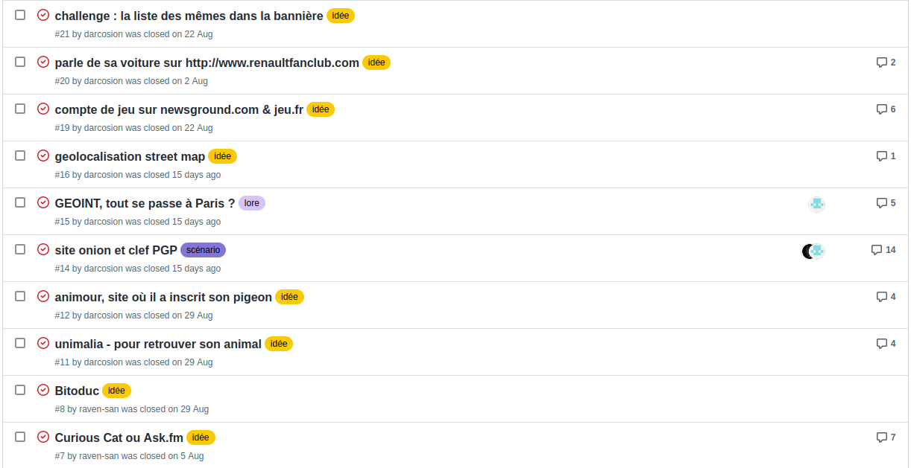
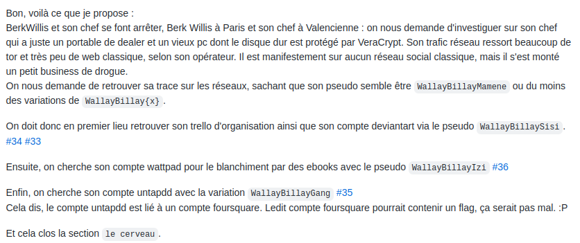
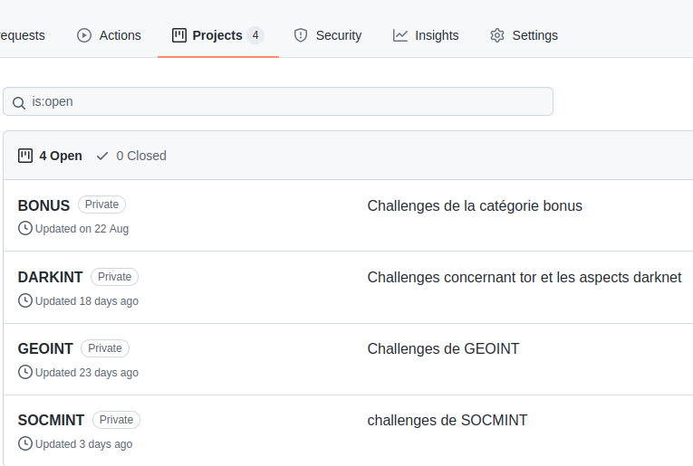
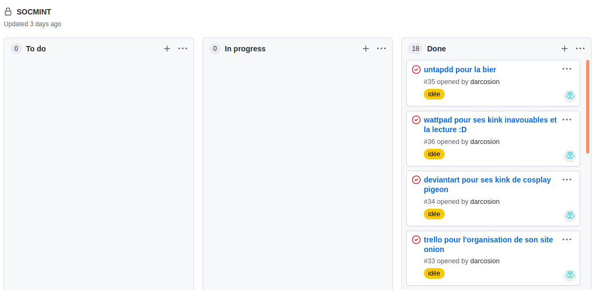
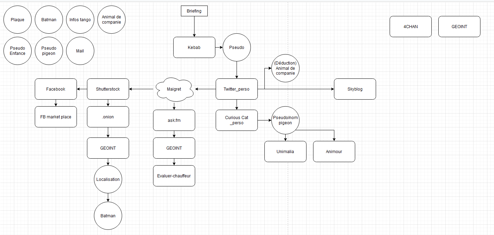
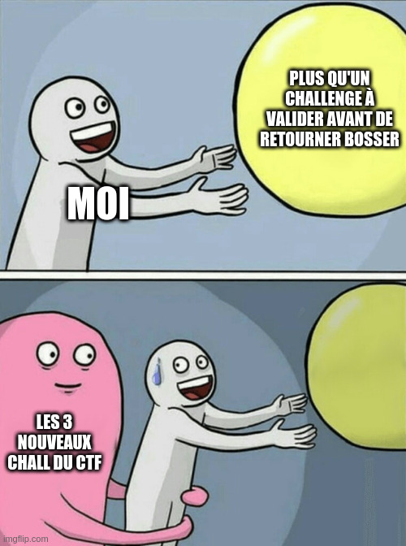

# histoire

## Génèse

L'histoire du Full Debilos est venu d'une discussion sur le vocal d'OSINT-FR entre Raven & moi même.

En discutant de sites à la con comme kebab-frites.com ou evaluer-chauffeur.fr, je me suis tourné vers lui et je lui ai dis :   
- "faut qu'on fasse un CTF avec absolument que des sites à la con comme kebab-frite ou evaluer chauffeur !"  

Ce à quoi il m'a répondu :
- "Mais... Hahaha... Pourquoi on est con comme ça ? XD Go !"

Et c'est sur cette note dont on pouvait ressentir l'abandon de l'intelligence et l'estime de soi que le Full Debilos CTF était né. Dès lors que ce début d'idée nous était venu, impossible de faire marche arrière.

## Diégèse

Après avoir fait quelques premières soirées pour discuter de nos idées, d'ambiances, d'astuces et d'idée tordues pour les participants du CTF, nous avons mis sur papier un univers que nous voulions créer.

Il peut se résumer ainsi :

L'idée générale est de partir d'un sujet super sérieux (menace d’État) et de dériver petit à petit vers du plus en plus ridicule :
 - on donne une vue générale sur un individu qui aurait mangé dans un kebab
 - on découvre ses comptes sur les différents réseaux sociaux
 - en parallèle, d'autres service d’état sérieux donnent des info, et à Valencienne, il pénètrent la maison du gars
 - ils demandent à retrouver son "mentor" déguisé en batman
 - au final, la personne qui était responsable de la recherche au niveau rens a missclick et a envoyé le mauvais nom

A la fin du CTF, on est félicité et on nous dis grosso-modo :

"""  
  Bon, il semblerais qu'il s'agissait d'une fausse alerte, l'individu que vous avez recherché n'avais rien à voir avec la menace d’État donné.
  Néanmoins, le président est au courant, et nous ne lui avons pas dis... tout ce qui s'est passé lors de nos recherche, il souhaite donc vous rencontrer et vous décerner la médaille du mérite pour service rendu à la nation.
  Vous ne devrez IMPÉRATIVEMENT rien dire de ce qui s'est passé en réalité ~~sinon je vais me faire virer....~~  
"""


Partant de ce postulat, nous avons énuméré des sites un peu débiles que nous pouvions utiliser, comme par exemple :
 - carimat (rencontre par plaque d'immatriculation)
 - evaluer-chauffeur.fr (site crée par les Waffen SS pour dénoncer les gens sur la route)
 - 4chan (bien sûr)
 - shutterstock (les images absurdes, on aime)
 - copain d'avant
 - skyblog
 - ask.fm (réseau social très utilisé par les adolescent entre 8 & 14 ans)
 - bitoduc.fr (traduction de terme informatique d'anglais à français)

Et une fois qu'on commençait à avoir une bonne liste, il nous a fallu un peu d'organisation.

## Organisation

Nous avons donc créé un git avec un repository github afin de disposer d'un espace de création et de stockage commun, avec la possibilité d'y déployer des applications (en l'occurrence le framework CTFd permettant de créer des CTF) et d'y stocker toutes nos ressources.

Nous avons utilisé sur Github les issues afin de se répartir les tâches et d'avoir un suivi sur qui est sur quoi. Et via le mécanisme de labelisation des issues de github, nous avons catégorisés notre travail sous cette forme :
 - idée (chaque site débile ou idée de challenge était inscrite sur une issue "idée")
 - infrastructure (issues associés au fonctionnement de l'infrastructure du CTF)
 - lore (issue décrivant des éléments de l'histoire du CTF comme des pseudo, des alias, des histoires des personnages, etc...)
 - scénario (issue résumant la plupart des voies par lesquelles les joueurs doivent passer pour arriver à la fin du CTF)


Ce qui donnait au final :



Au niveau des scénarios, nous référencions les différents challenges associés à un scénario, comme ceci :


Enfin, nous avions tout un processus de gestion d'avancée des différentes parties du CTF, du scénario et des différents challenges :


A ce niveau, nous nous étions imposés l'obligation de terminer à 100% chaque challenge avant de diffuser la section concernée :


Pour conserver une certaine visibilité sur les chemins possibles de l'enquête et ce qui devait être accessible après quoi, Raven a employé un fichier draw (draw.io) sous cette forme :
  

## Développement

A partir de là, nous avions une méthodologie de développement qui pouvait se résumer à ça :
 - on parle d'un site débile
 - on essaie de créer un challenge dessus
 - on l'adapte au niveau du lore
 - on le documente sur l'issue associé
 - on le valide et on ferme l'issue

Le processus a débuté par la création des comptes. Puis sur quelques sites, il  a fallu créer de l'activité... de longues soirées à se poser les questions les plus idiotes sur ask.fm et curiouscat (on a aussi reçu de nombreuses questions d'autres utilisateurs !), a battre nos scores sur jeux.fr ou a rassembler les images pour alimenter le skyblog, le facebook, le twitter ...  
Enfin vient la phase de rédaction. Les proses de @Raven_ ont particulièrement été appréciés. (ici Raven, gros coeur sur vous, j'écrirai mes mémoires à l'occaz)  
L'ensemble des challenges ont été documentés avec leur solution dans un fichier sur github. Nous y avons inclus le titre, le corps du texte, les hints, le lien vers le flag et le flag.

Bien sûr, beaucoup de sites sont passés à la trappe lorsque nous nous sommes rendu compte qu'ils étaient impossibles à utiliser pour de l'OSINT.
Tous les sites comme rencontre-puceaux et rencontre-de-droite appartiennent à des sociétés écrans liées à un groupe d'arnaqueur bien organisés, et ces dernières étaient donc de facto impossible à utiliser car ce n'était pas de réels sites de rencontre.  

De la même façon, Unimalia (site de rencontre pour animaux) avait une modération trop active et a bloqué nos profiles, ce qui nous a empêché d'ajouter ce challenge à la catégorie 'une histoire de pigeon'.  

Le forum sos-pigeon toujours dans cette catégorie a été éliminé des vrai challenges car nous le trouvions au final trop difficile à traduire en challenge.

De la même façon, le forum turc renaultfanclub avait une modération trop active et le compte aurait été dur à traduire en challenge.  

Également, l'application Carimmat permettait de discuter en live à partir d'une plaque de voiture, malheureusement, cela ne permettait pas de créer un profil aisément sans installer l'application sur mobile. Ne voulant pas mettre en place sockpuppet spécialisé pour ça et voyant le gap que ça serait pour les participants, nous avons préféré éliminer ce challenge.

Enfin, Copain d'avant est un sous-domaine de linternaute.com où nous avions constaté qu'il n'était plus possible de s'inscrire. De ce fait, cela bloquait une bonne partie du lore sur l'enfance et l'adolescence de la cible, et par extension, nous avons supprimé cette partie de son lore. Toutefois, nous avions envisagé en alternative l'application trombi, mais trop complexe pour nos objectifs de reprendre cette partie là du CTF.


## Avant le lancement
Après avoir créer tous les challenges, il a fallu s'assurer que les flags étaient toujours présents. Plusieurs checks de flags ont dû être réalisées.  
En particulier, le flag de evaluer-chauffeur a nécessité d'être mis en ligne plusieurs fois. Nous avons dû nous calmer sur l'activité de cette page : la plaque du CTF étant passée dans le top des plaques du mois !

Les logins et mots de passes des comptes étaient initialement uniquement dans les issues, la création d'un fichier pour centraliser tous les logins s'est avéré bien utile.

## Lancement

Pour commencer, notre première idée était de réaliser un CTF de petite envergure avec juste les copains d'OSINT-FR que nous connaissions plus au moins sur le serveur. Ce qui a donné ce message de teasing sur le channel #general :
```
Medames & Messieurs, le FDCTF arrive bientôt.
Un petit CTF de la communauté OSINT-FR créé par @UnBatal, @Raven_ & @darcosion.
On prépare ça pour septembre et on espère que ça vous fera marrer/kiffer/rager/développer une nouvelle façon de voir l'universe.
```

Par la suite, nous avons publié sur le channel #challenges-list le CTF avec une véritable date de départ ainsi que des informations réellement pertinentes :
```
FULL DEBILOS CTF 🐒
https://fulldebilos.fr/

Date :  20 September 2021 à 12h (UTC+1) - 4 Octobre 22h (UTC+1)
#OSINT, geoint-imint, dorking, masint ?,rumint ?,  socmint, cyber

Chers collègues, bienvenue au Full Debilos CTF, le seul CTF de la communauté OSINT-FR dont même OSINT-FR ignorait l'existence il y a quelques semaines.
L'idée nous est venue sur un coup de tête et quelques singeries plus tard le CTF était né.
Ne vous fiez pas à son nom et inscrivez vous grâce au code promo rosoVPN (c'est notre sponsor faites pas gaffe)
On vous attend nombreux, on espère que ça vous plaira !
Les 12 premiers disposeront d'un badge officiel du Full Debilos CTF qui rend très bien sur le CV, 100% recrutement sans poser de question, garantit pas remboursé. ;)

Raven, Darco et UnBatal
```

Cependant, ce message a été repris par des gens de la communauté sur twitter, diffusant le CTF que nous voulions discret sur la place publique.
A ce moment là, nous avons décidé de faire une annonce officielle via le twitter de raven : https://twitter.com/0xraven_/status/1436738598573850624

Et a notre grande surprise, ce tweet a eu une visibilité assez grande (3426 vues ?) ce qui a fait s'inscrire au total 168 personnes pour 76 teams formés.

Cela a rajouté sur les épaules de notre équipe d'administration du CTF plus de stress pour qu'au lancement nous soyons fébriles.

Pour être tout à fait honnêtes avec vous, on ne s'attendait pas du tout à un tel engouement sur le CTF, beaucoup de gens ont regrettés de ne pas avoir pu s'inscrire :/

## Déroulement

Le CTF s'est passé sans problèmes majeurs. Quelques instabilités sur la plateforme CTFd que nous avions mis en place (3 crash au total), quelques équipes qui ont rencontré des soucis, mais dans l'ensemble, rien de problématique.

Cela a occupé beaucoup de notre temps mais nous avons eu pu diffuser 5 challenges de plus en surprise que nous avons développé durant le weekend entre la première et la seconde semaine du CTF.

Et ces challenges surprises en auront traumatisé plus d'un :   
  

## cloture

Le dernier jour du CTF, nous avons réglé la date de fin du CTF à 22h, puis nous avons rédigés un message de fin expliquant la clôture du CTF.

Erys nous a trouvé un magnifique template pour les 3 premières équipes :


Et par la suite, nous avons géré les remises de certification sur la plateforme badgr.io, tout cela entièrement manuellement car nous ne voulions pas mettre des centaines de mails sur badgr.io sans le consentement des gens et nous proposions d'utiliser juste le pseudo, juste le nom/prénom ou encore juste une url de linkedin.

Enfin, en parallèle, nous avons rédigé un retour sur le CTF de notre point de vue, mais avec 4 points de vue qui ont été décrits dans le [README](README.md).
