# Write-Up

Dans cette section, nous décrivons chaque challenge de manière un peu fonctionnelle puis sa résolution. Le tout, par section.

# bonus

## Meilleur commu

Quelle est la meilleur communauté discord ?

**Méthode :** Un raisonnement analytique devait être déployé sur l'énoncé pour apporter un support de recherche permettant la déduction dudit flag par un recoupement des informations.

**réponse :** `flag{OSINT-FR}` ou juste `OSINT-FR`

## Formulaire AB28 à rendre

Petit bonus : dans la bannière du CTF, nous avons mis beaucoup de mêmes. :D

Si vous arrivez à retrouver le nom de chaque [même](https://fr.wikipedia.org/wiki/M%C3%A8me_Internet) associé à une image de gauche à droite, que vous prenez la première lettre de chacun des noms, et que vous assemblez cette liste au format `flag{XXXXXXXXXXX}`, alors vous pourriez gagner honorablement quelques points.

**Méthode :** Il faut trouver l'initial de chaque même depuis internet. En premier lieu il est nécessaire de découper et isoler chaque même dans la bannière, puis une recherche inversé permet de retrouver le même d'origine. En général en trouvant le même d'origine, on obtient son nom. Et à partir du nom, on peut utiliser KnowYourMeme pour confirmer le nom du même.

**réponse :** (regex) `flag{HDPLE[BC][LMJ]D[SR][UTC]D}`

## G ri1 vu ri1 entendu

Avez-vous vu quelque chose ici ?

**Méthode :** Dans une page qui se nomme "Test_1212", on trouve un texte `ok, donc a priori, on peut écrire du texte ici`. En réalité, il y a un texte en blanc sur fond blanc tout en morse.  
Il faut passer ce texte dans un outil comme CyberChef pour décoder le morse.  
Cela donne un texte en hexa qui est décodable.  
Ce texte donne du base64 qu'il faut décoder au moins 6 fois.  
Et enfin, cela donne un texte `synt{Z0eF3_P0hYq_F4I3_H}` qui **n'est pas le flag**. Il faut en réalité le faire passer en ROT13 pour qu'il devienne un bon flag.

**réponse :** `flag{M0rS3_C0uLd_S4V3_U}`

# enquête principale

## Briefing

Gerbier, vous avez été mandaté par la SDAT (Sous-Direction Anti-Terroriste) pour contrer un possible attentat envers la présidence.  
Les unités de recherche sont injoignables à l'instant T et ce dossier est urgent. Je sais que ça sort un peu de vos fonctions initiales.   
Toutefois, vous êtes le seul à ce niveau d'habilitation et avec autant de connaissances en recherche avancée.  
Nous disposons de peu d'informations à l'heure actuelle. Vous allez devoir utiliser toutes vos compétences pour retrouver cette personne et qualifier le danger. Si le danger est réel, nous déploierons une unité spéciale d'intervention pour l'appréhender selon vos informations.  
Bonne chance Gerbier, votre mission est de la plus-haute importance.   
Tapez `flag{Roger}` pour clore le briefing et démarrer la mission.  

Alice B  
Cheffe de service

**Méthode :** lire

**réponse :** `flag{Roger}`

## une affaire de saveur

Gerbier, selon nos sources l'individu recherché aurait, je cite "dégusté un délicieux plat carné composé de viande de mouton, de légumineux variés et de préparation boulangère de qualité, dans l'établissement du plus grand maître kebabier de Tourcoing". La source refuse de nous en dire plus et s'est murée dans le silence. Pendant que nos agents lui chatouillent les pieds pour la forcer à parler, vous devez impérativement suivre cette piste.


Trouvez le kebab, Gerbier, le sort de la nation en dépends.

**indice :** `Ici la source ! j'ai réussis à m'échapper et à trouver de quoi vous envoyer un message. Ces fifrelins du service d'enquête n'ont rien voulu entendre et ont passé leur temps à m'interroger sur mes accointance avec le PKK ou le KKK au lieu d'écouter ce que j'ai à dire. J'ai un nombre limité de caractères et peu de temps, alors écoutez bien ce que j'ai à dire. L'individu à mis une bonne note au kebab, mais ne fais jamais rien normalement sur internet, vous ne le trouverez jamais sur tripadvisor ou maps, -argh, ils arrive-, allez chercher plutôt sur` -> Cet indice a pour but de faire éviter à tout le monde des applications comme uber eat, google maps ou tripadvisor, au cas où certains voudraient sauter la case dorking.

**Méthode :** Sur google, la dork "kebab tourcoing" fait ressortir le site kebab-frite.fr sous cette forme :
  
Il faut donc s'arranger pour avoir un profil français pour éviter des recommandations inadaptés au CTF. :S  

Une fois sur la page https://www.kebab-frites.com/kebab/tourcoing-v27403.html  
On prend le premier kebab qui ressort : https://www.kebab-frites.com/kebab/my-kebab-tourcoing.html  
On trouve un commentaire :   
```
meilleur kebab pour s'exploser le bide (et pas que)
CTF{La_Kebaberie_n_est_jamais_finie}
```


**réponse :** `CTF{La_Kebaberie_n_est_jamais_finie}`

## radio libre

Gerbier, la source que nous avons capturé a commencé à nous livrer des informations. Selon elle, il utilise une plateforme de micro-blogging. Il l'utilise pour préparer ses plans et les communiquer à son officier traitant.

**indice :**  `Est-ce qu'un jour tu m'as vraiment aimé ou est-ce que pour toi ce n'étais qu'un jeu
Car tu sais que tu es le premier  que j'ai aimé, et j'aimais quand on étaient tout les deux ...` (x tout les indices à 5 points) -> Ces "phrases" viennent du skyblog suivant : https://x-belle-phrase-x.skyrock.com/, chaque indice est à moitié un "troll". Ils ont pour but de faire confirmer l'existence d'un skyblog appartenant à la cible.

`Généralement les terroristes n'utilisent pas des plateformes sérieuses comme Wordpress ou Blogspot. Penchez-vous sur des plateformes frivoles ou pueriles.` -> Cet indice là est vraiment un troll. Il a pour but de confirmer que c'est bien un skyblog mais coûte plus cher.

**Méthode :** Depuis la page kebab-frites, on peut constater que le compte qui a posté le commentaire du challenge "une affaire de saveur" se nomme "berkwillis".  
Si on cherche son pseudo sur internet, la première chose à sortir est son twitter :
https://twitter.com/warham_  
Son twitter ne contient rien d'utile, mais son alias est "warham_". Or si on enlève l'alias, on constate qu'un autre compte twitter existe bel est bien et n'est aucunement lié au compte. On peut donc supposer que le `_` a été ajouté sur twitter mais que son pseudo original est `warham`.  
On va donc chercher un warham sur skyblog : https://warham.skyrock.com/  
Ce compte ne contient rien, mais on peut y lire "c mon compte de secour lol".
On remarque qu'il est abonné à un autre compte, si on y va, on voit :
https://wahram.skyrock.com/

Il y a apparemment 5 pages de barrage waifu de mis, néanmoins, si on les parcours, on constate qu'il n'y a aucun mouvement dessus, sauf à la 4ème page, un commentaire :   
https://wahram.skyrock.com/4.html  

Et si on clique dessus, on obtiens le flag : https://wahram.skyrock.com/3343750940-posted-on-2021-08-04.html?action=SHOW_COMMENTS

**réponse :** ` flag{S41µ7_C_D1F00L}`

## meow 🐈

Enfin ! Vous avez une trace. Il faut maintenant tirer la ficelle pour découvrir ce qui se trame.
Voyez si vous pouvez en apprendre plus sur lui, il y a certainement quelque chose de visible pouvant nous mener à lui.

**Méthode :** Depuis la page kebab-frites, on peut constater que le compte qui a posté le commentaire du challenge "une affaire de saveur" se nomme "berkwillis".  
Si on cherche son pseudo sur internet, la première chose à sortir est son twitter :
https://twitter.com/warham_  

Sur ce twitter qui semble ne contenir aucune information, on remarque qu'il a mis en biographie de profil "i'm a curious 🐱".  
On peut supposer de part le titre du challenge que cela a un rapport avec le challenge.
Si on tape sur google "i'm a curious cat" :   
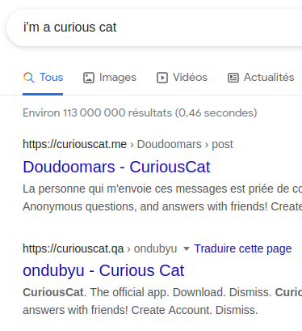  
On peut constater qu'un site qui se nomme curiouscat.qa existe et qu'il ressemble pas mal à twitter.  
Et si on essaie de s'y créer un compte, on constate qu'il demande par défaut un compte twitter à rattacher.  
On essaie de donc de faire matcher le compte de berkwillis avec ce réseau, et bingo : https://curiouscat.qa/BerkWillis  

Néanmoins, on peut aller plus loin en vérifiant depuis l'API que cela correspond réellement, et pour cela : https://curiouscat.qa/api/v2.1/profile?username=BerkWillis&_ob=registerOrSignin2

Cela renvoie un JSON qui contient l'id twitter de la cible :
```json
{
    "id": 20482902,
    "verified": false,
    "username": "BerkWillis",
    "twitterid": "1421054235324653575",
    "facebookid": false,
    "facebooklink": false,
    "answers": 31,
    {...}
}
```
Cela confirme qu'il s'agit bien du même individu.

Ensuite, on peut chercher le flag sur son profil. Rapidement, on trouve ceci :
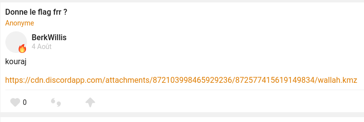  

Le fichier KMZ concerné est un fichier contenant un point d'intérêt sur Google Earth qui pointe vers la place de l'étoile.
Néanmoins, le point est situé 400m en dessous du niveau de la mer, ce qui le rend illisible par défaut. Il faut accéder à ses propriétés pour pouvoir lire le flag.


**réponse :** `flag{ch4m3di}`

## stock

Gerbier,
Notre source nous a annoncé qu'il lui avait parlé d'un business. Nous n'avons aucune information sur ce business. Nous ne savons qu'une chose, il doit forcément afficher ce qu'il vend pour intéresser les gens.
Trouvez la plateforme où il affiche ses produits.

Format de flag : `flag{...}`

**Indice :** `Il doit utiliser une grosse plateforme de photo, mais sans doute d'un autre pays pour ne pas éveiller les soupçons.` -> Cet indice met sur la voie d'une plateforme d'upload de photo non française uniquement.

**Méthode :** Sans l'indice ni outil magique, ce challenge est un peu compliqué car le titre (stock) faire référence à [des vidéo d'antoine daniel sur le site shutterstock](https://www.youtube.com/watch?v=LHT0RB4_xYo) et la description du challenge laisse à penser qu'il s'agit d'une plateforme de vente.  
En réalité, si on passe le pseudo "berkwillis" sur Maigret, on obtient presque immédiatement : https://www.shutterstock.com/fi/g/berkwillis/about qui contient le flag.  
Si le compte pouvait rendre cela publique, vous verriez aussi des listes d'image faisant référence à la drogue, au darknet et au hacking (kiddies) mais malheureusement, shutterstock est une plateforme très complexe à gérer.   :(

**réponse :** `flag{ST0CK_0PT10N}`


## Welcome to my world

Gerbier !
Nos moyens d'interception nous ont permis d'obtenir une image de "Risitas". Explorez la piste. Pensez comme lui, je sens que l'on commence à entrer dans son univers.

**Indice :** `Notre informateur a dit qu'il est un "reille". Trouvez ce que ça veut dire.` -> Cela fait référence aux "khey", expression algérienne voulant dire "frère" qui est également utilisé massivement par les utilisateurs du forum jvc.com.

**Méthode :** Le terme "risitas" renvoie depuis google très vite sur le forum jeuxvideo.com. A partir de là, on peut réessayer les profils trouvés dans les challs précédents, et l'on trouvera :  
https://www.jeuxvideo.com/profil/warham?mode=infos

A partir de ce profil, on trouve cette publication troll dans laquelle est le flag :
https://www.jeuxvideo.com/commentaire/message/16183986

**réponse :** `flag{L3S_KH3Y_G4RS}`

## eh ouai les jeeeez

Les tests SIGYCOP de l'individu indiquent un fort besoin de s'exposer et de répondre aux questions d'une foule en délire. Le profiler appuie cet avis et nous indique qu'il a très probablement un réseau social dédié à ce besoin.

**Méthode :** La description du challenge ne sert qu'à donner une indication du réseau social à explorer. A partir du twitter découvert via le pseudo obtenu dans "une affaire de saveur", on peut trouver, si on passe le pseudo "berkwillis" dans l'outil maigret, un compte ask.fm : https://ask.fm/berkwillis

Une fois sur le compte ask.fm, le titre prend son utilisé car en lisant le texte, on se rend rapidement compte qu'on est tombé sur le bon individu, et cela est d'autant plus confirmé par l'image de profil montrant un pigeon gangsta.

Pour parcourir le compte ask.fm, il y a deux possibilités. Soit se créer un compte sur ask.fm, soit désactiver le javascript. Sinon, on se retrouve avec ce genre de pop-up bloquant :  
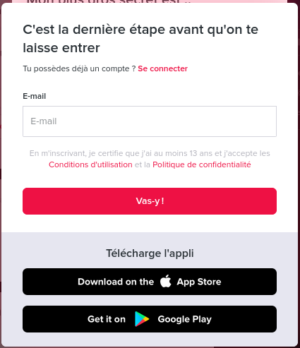

Une fois ce problème résolu, on peut explorer, et au bout de la 3ème page, on trouve le flag : https://ask.fm/berkwillis?iterator=50&older=1628108323

**réponse :** `flag{4sK_Me_SoMeThInG}`

## lezard lord realm

Il doit bien passer par une autre plateforme pour contacter des acheteurs potentiels. Vous avez cherché du côté des plateformes mainstream ?

**Indice :** `Ce challenge est malheureusement basé sur une fonctionnalité temporaire. Il est possible que chaque jour entre 7h et 9h du matin, le flag ne soit pas accessible.` -> Ce challenge est basé sur la notion de story sur facebook. Lesdites story étant accessibles uniquement 24h, nous avons du les réuploader chaque jour.

**Méthode :** Via la recherche google sur "berk willis", on trouve rapidement le facebook (nous n'avions pas prévu qu'il soit aussi bien référencé). A partir de là, en cliquant sur son image de profil, on trouve ses story et cette story est celle qui contient le flag :  
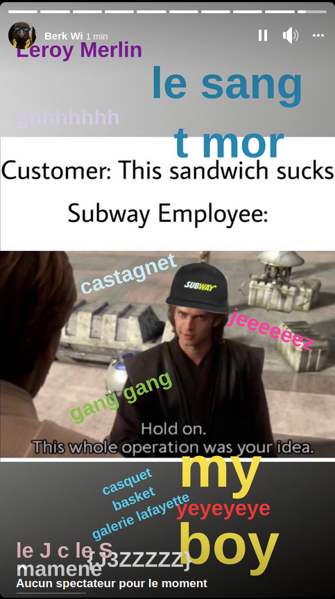

**réponse :** `flag{J3ZZZZZ}`

## face de bouc

Bon Facebook, c'était assez évident. Creusez cette piste là, on va pouvoir remonter son filon de revente.
La source nous a indiqué qu'il utilisais facebook pour son business.

**Indice :** `vous avez exploré tout facebook ?` -> cet indice ne sert qu'à confirmer qu'il ne doit chercher que sur facebook.

**Méthode :** A partir de facebook, il faut simplement scroller et on finit par trouver une vente de pigeon : https://www.facebook.com/marketplace/item/961716544376002/?rid=168207258683551&ad_id&rt=1&refID=0&refType=0  
Qui contient donc le flag.

**réponse :** `flag{S1LKR04D}`

## cracked

Gerbier, j'ai le sentiment que nous passons à coté de l'essentiel dans cette affaire. Il ne peut pas tout diffuser sur facebook car facebook est un réseau fermé. Il publie forcément ses annonces sur une autre plateforme plus ouverte. C'est une sorte de sixième sens qui me le dit Gerbier.  

Trouvez cette plateforme et apportez la preuve, que nous ayons le fin mot de l'histoire Gerbier. Le président nous a envoyé un message, il compte sur nous !

**Indice :**
```
Alors Gerbier, l'enquête piétine ?!?

Vous n'êtes pas assez dans la tête de notre cible ! Faut regarder plus de vidéo abrutissantes ! Allez voir les anges de la télé-réalité voyons, ou bien regardez donc cette nouvelle star des jeunes là... squeezie, qui fait des vidéo sur le bricolage et des subreddit, peut-être que vous aurez une révélation !
```
Cet indice est là pour inciter à aller sur la chaîne youtube de squeezie, qui contient notamment ceci : https://www.youtube.com/watch?v=sOoTg6ihsZM

**Indice :** `Il doit s'agir d'un site avec une sorte de liste de ce qu'il recherche...` -> Cet indice confirme juste le type de site sur lequel chercher.

**Méthode :** Pour cracked, le nom du challenge est un indice en soit si on connaît un peu la culture américaine. A partir de l'indice, on peut trouver craiglist qui correspond pas mal à la description.  

Depuis craiglist, si on connait un peu son interface, on peut filtrer par localisation : https://paris.craigslist.org/

N'ayant ni tourcoing, ni valencienne, Paris est la seule localisation correcte.

A partir de là, on peut constater que beaucoup de sections sont vides, comme immobilier ou cycle, mais beaucoup d'autres sont pleines, il est donc possible de trier par ouverture de sections rapide, pour ne conserver que celles qui sont longues à parcourir.
Et de cette façon, on finit sur "petit boulot" : https://paris.craigslist.org/d/petits-boulots/search/ggg

Ce qui permet de trouver cette annonce contenant le flag : https://paris.craigslist.org/cpg/d/fais-du-biz-avec-moi/7372668155.html

**réponse :** `CTF{J3_V3ND_M0N_4M3_5UR_CR416_1157_P45_CH3R}`

## [NSFW] Khôlle

Une sonde réseau de surveillance nous a indiqué son attrait pour des sites de streaming très spécifiques. Nous pensons qu'il se forme au maniement de sexplosifs en comprenant l'ingénierie, la chimie et les mathématiques inhérents.
Trouvez de quelle type de préparation il s'agit, nous ne voulons pas de menace NRBC sur le territoire !

PS: format du flag : `flag{inPUT}`

**Indice :** `Certains profs peuvent avoir des idées étranges...` (x 4) -> Ces indices sont des blagues pleines de sous-entendu sur ce qu'il fout.

**Indice :** `La source nous a confirmé qu'il s'était inscrit sur ce site sous sa véritable identité. **Ca donne envie** de se fendre d'un petit commentaire sarcastique.` -> Cet indice permet de deviner qu'il est inscrit sous `berkwillis`.

**Méthode :** A partir d'outils comme Maigret, si on tape son vrai nom `berkwillis`, on trouve : https://fr.pornhub.com/users/berkwillis

On voit tout de suite qu'il a mis une vidéo dans ses favoris, et si on va dessus, on constate qu'il a laissé un commentaire.

**réponse :** `flag{toi_aussi_élargis_ton_savoir}`

## forza toi

Vous ne cessez de m'épater Gerbier ! Avec ce que vous avez trouvé vous devriez pouvoir apporter des informations capitales pour nos services !
En passant par le SIV, nous nous sommes rendu sur la dernière localisation connue du véhicule. Choux blanc. Faites en sorte de retrouver ce véhicule. N'oubliez pas que le chauffeur s'est enfui du kebab en driftant à toute berzingue.
Mon supérieur m'informe que cette information sera suffisante et que nos équipes creuseront au besoin. Pas besoin de continuer sur cette voie là plus longtemps après la résolution du challenge.

**Indice :** `Qui drift en sortant du kebab ? Il doit s'agir d'un chauffard...` -> cet indice est ici pour indiquer qu'il faut chercher un site de référencement des chauffards.

**Indice :** `tous les allemands ne sont pas nazis monsieur...` -> J'ai aucune idée de pourquoi on a mis cet indice là... (oubliez pas les admins aussi sont des débiles)

**Méthode :** Depuis [le compte curiouscat](https://curiouscat.qa/BerkWillis), on trouve ici une plaque de voiture :  
`J'te khalass en drepou dperlinpinpin tkt. On s'capte quand t'as get la caisse
tien vla la plaque : GG-453-VF`.
A partir de cette plaque de voiture, il faut aller sur : https://evaluer-chauffeur.fr/GG-453-VF
Et on obtiens le flag.

**réponse :** `flag{GGV01TuR3}`

## Nouvelle préparation de terrains

On a passé son Ask.fm dans un script pour récupérer ses photos. Il y a d'ailleurs une photo de jeu vidéo mais nous ne parvenons pas à trouver le nom du jeu, ni le site.
Retrouvez son compte sur ce jeu Gerbier, ça nous permettra de dresser son profil psy plus rapidement.
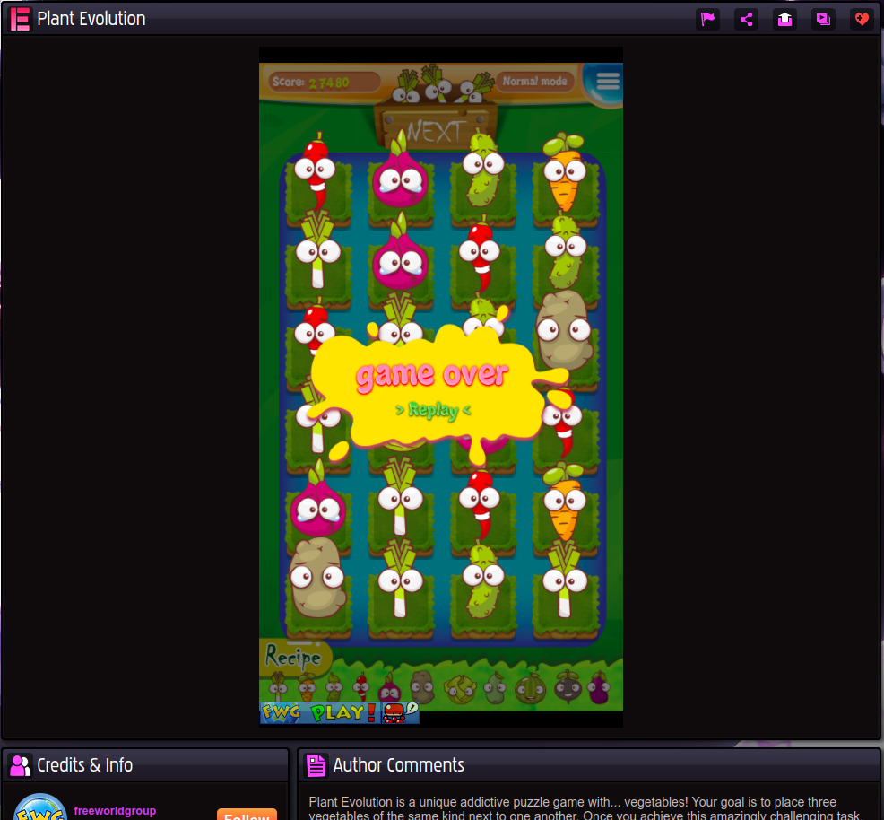

**Méthode :** Pour ce challenge, quasiment tout repose sur l'image. En premier lieu, si on cherche sur Google le texte de description de l'auteur du jeu, on trouve cela :  
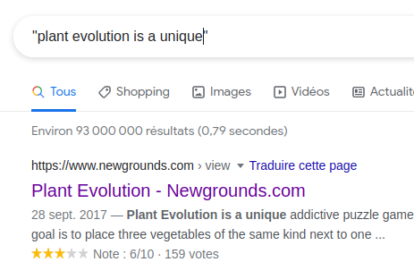

Et dans les commentaires, on retrouve le flag.

**réponse :** `flag{C4RRY_L4_G4M3}`

## This was my plante

On a passé son CuriousCat dans un script pour récupérer ses photos. Il y a d'ailleurs une photo de jeu vidéo mais nous ne parvenons pas à trouver le nom du jeu, ni le site.
Retrouvez son compte sur ce jeu Gerbier, ça nous permettra de dresser son profil psy plus rapidement.

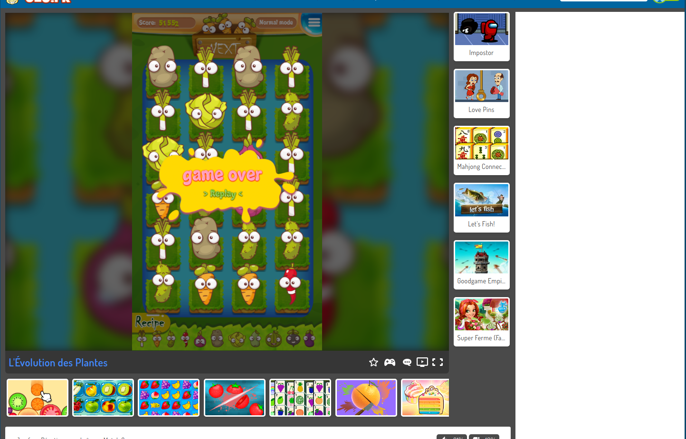

**Indice :** `Pour créer ce chall, les 3 compères ont du jouer des heures à ce P%$£% de jeu, et ils étaient souvent présents en vocal sur OSINT-FR... Peut-être que la communauté OSINT-FR est propice au RUMINT ?` -> Ici, l'indice est un peu drôle car il indique que le vocal d'OSINT-FR peut être intéressant. Or il n'y a pas de logs du vocal. En revanche, il y a un channel associé qui se nomme #no-mic .
Si on cherche dedans "salade", on trouve très vite :  
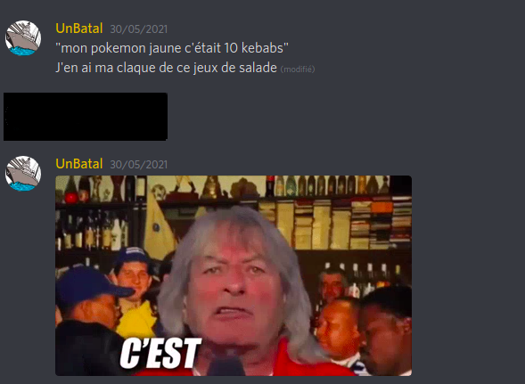  
Puis un peu plus bas :  
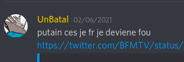  
Ce texte peut se traduire par `ces jeux fr, je deviens fou`.

Or, si on cherche jeu.fr on retrouve l'interface exacte du site qui est affiché dans le screenshot.

**Méthode :** Ici, la recherche est plus complexe, mais il y a plusieurs façons de faire. Soit on sélectionne le texte en haut et on essaie de deviner le titre du site, soit on le passe dans google image, ce qui retourne le site avec un peu de doigté, soit on parcours tout google à la recherche de tout les endroits où le jeux "plant evolution" a été diffusé.

Une fois le site trouvé : https://www.jeu.fr/jeu/levolution-des-plantes  
Bien penser à activer javascript car les commentaire en dessous du jeu sont entièrement dynamiques. Et dans les commentaires, on trouve bien le flag.

**réponse :** `flag{pL41nG_W1tH_F00D}`

## tempora mori

Cette fois-ci, nous y sommes ! Notre informateur nous a dis que "son chef, il est plutôt connu dans le quartier". Il est également connu pour se déguiser. Il faut absolument attraper cet individu, localisez le et donnez nous son déguisement précis, nous enverrons une équipe le cueillir
Cette étape est finale, pas besoin de chercher plus loin après.

**Méthode :** Depuis le challenge "message reçu" dans la partie onion, on peut déchiffrer ses messages PGP. Dans un des messages on trouve celui-ci :
```
sry frerr, j'me saigne en ce moment, quant sa ira mieux, je te referais une livraison, et tkt jte mettrais bien

au cas ou, jte laisse mes coordonnés :  181 Bd Henri Harpignies, ya mon poto qui te livrera aussi, c'est lui le chef
```

A partir de cette information, on passe dans Google Streep View dans la zone, et on trouve en remontant en 2015 ceci : https://www.google.com/maps/place/181+Bd+Henri+Harpignies,+59300+Valenciennes/@50.3640192,3.5269729,3a,18.8y,147.38h,66.52t/data=!3m7!1e1!3m5!1s51qRNw4Jbr0QwaOmPUxdcQ!2e0!5s20160801T000000!7i13312!8i6656!4m5!3m4!1s0x47c2edc27ad22ce7:0x465028c4a731eb45!8m2!3d50.36404!4d3.5267254  
Et de cette façon, on obtient le flag.

**réponse :** `flag{BATMAN}`

## et je me balance - 1

Gerbier,
Notre informateur nous apprend qu'il aurait fait venir du matériel de l'étranger pour ses affaires. Nous avons obtenu un témoignage indiquant qu'il est venu d'un container d'une entreprise nommé turkon, pouvez-vous retrouver son nom complet ?

**Indice :** `flag example : flag{THE_NAME_OF_A_SHIPPING&TRANSPORT_COMPANY}`

**Méthode :** Sur Google, il faut effectuer une recherche de conteneur via un outil comme bic-code.com. Par exemple : https://www.bic-code.org/search/?searchterm=turkon
Cela donne `TURKON CONTAINER TRANSPORTATION&SHIPPING`.

**réponse :** `flag{TURKON_CONTAINER_TRANSPORTATION&SHIPPING}`

## et je me balance - 2

Bravo !
Nous avons également obtenu de notre source le numéro du container : 4133067. Nous avons perdu l'indexe des containers dans le port, pouvez-vous nous donner la couleur du conteneur ainsi que son nom ?

**Indice :** `flag : flag{COULEUR|Nom Du Container}`

**Méthode :** Pour trouver rapidement, on peut tapper l'identifiant de l'entreprise + l'id du container. On trouve rapidement ceci :  
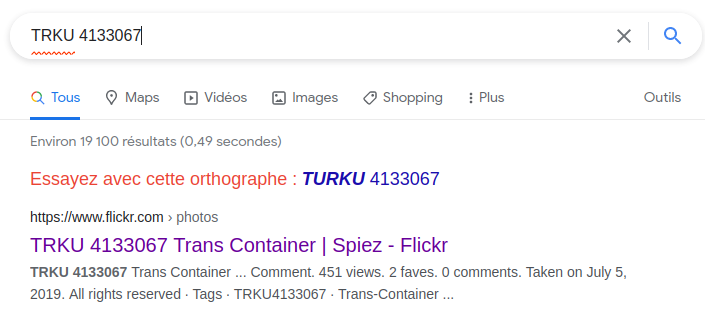  

Et sur la page flickr, on trouve le container de couleur bleue : https://www.flickr.com/photos/125258141@N06/50103942652/

**réponse :** `flag{BLEU|Trans Container}`

# dark

## find the door

Gerbier,
Nous savons qu'ils tient un business mais n'avons aucune trace de celui-ci malgré vos investigations. Peut-être est-ce le moment d'avoir une pensée plus profonde. Réflechissez Gerbier, il ne peut pas être invisible.

**Indice :** `Il a sans doute laissé une trace sur un autre site` -> Cet indice est ici pour indique que l'adresse de l'onion se trouve sur le compte du newground : https://wallaybillaymamene.newgrounds.com/

**Indice :** `Il a du se pencher sur une technologie plus sombre, quelque chose de profond...` -> Cet indice est ici pour confirmer qu'il s'agit bien de darknet, et plus précisément de tor.

**Méthode :** A partir du compte newsground : https://wallaybillaymamene.newgrounds.com/  
On trouve l'url. Cette url mène sur le site où le flag est affiché en couleur sombre.

**réponse :** `flag{MAMENE_LA_DREPOU}`

## message reçu

Il a donc un business sur tor... Bien joué Gerbier ! Il a apparement pris des dispositions de sécurité. Il chiffre ses réponses avec PGP. Voyez si vous pouvez trouver quelque chose de compromettant, une erreur dans sa méthodologie par exemple.

**Méthode :** Sur la partie contact du site, on peut constater qu'il a mis sa clé privée. Cette clé est importable dans kGPG ou dans GPA ou directement en cli via `gpg`. Une fois qu'on dispose de cette clé privée, il est possible de déchiffrer tout les messages PGP, l'un d'entre eux contient le flag.

**réponse :** `flag{PGP_BRANCHE}`

## bidoullieu

Une équipe technique est sur le coup néanmoins, ils m'ont remontés qu'ils ne parviennent pas à obtenir la version de la bibliothèque de compilogénèse de feuille de style en cascade employé sur le site. Si vous pouvez les débloquer, je suis preneur.

**Méthode :** Depuis le site onion, il faut afficher le code source, on trouve la lib bootstrap `llvhogyuo26fdqkyf54rom2gwd5y4njrwtmdnrvzr3kdt4uxnrolysyd.onion/bootstrap.min.css`.
La version se trouve dedans.

**réponse :** `flag{v5.1.0}`

## chui dans une sacré salade y'mfaut deux avocats

La source viens de nous indiquer qu'il dispose d'un second site onion. Essayez de le trouver, il a forcément commis une erreur qui doit permettre de le retrouver.

**Méthode :** Depuis le premier site onion, des recherches avec des outils comme wfuzz, onionscan ou dirbuster font ressortir une page qui se nomme `llvhogyuo26fdqkyf54rom2gwd5y4njrwtmdnrvzr3kdt4uxnrolysyd.onion/server-status`

Cette page contient l'url du second onion `ow5uohyzw4i5qq2bmkwhpscra6je6nmmupx47w447tndspxac6wfbpqd.onion`.

Dans la partie about, on peut lire ça :

```
vazy si joubli j’ai laissé mon code sur le site. (indice W)
```

Cette indice indique en réalité une directory sur le site qui se nomme `wallay`. Pour l'obtenir, il faut un peu bruteforcer (par exemple avec zfuzz ou en devinant).

Une fois cette directory découverte, on trouve directement le flag dedans.

**réponse :** `flag{J3_V415_70U7_C4553r}`

## Pownion

Bon... De ce que nous avons pu en voir actuellement et du retour que l'équipe technique vient de me faire, ce jeune homme n'est pas très doué en informatique. Vous devriez pouvoir remonter son serveur et trouver quel est en réalité son infrastructure. Creusez sur son second site, il y a forcément quelque chose. Une adresse mail lié à son identité par exemple.

**Indice :** `Il est clair qu'il ne maitrise pas le déploiement d'un service web derrière un onion. Il y a forcément une faille qui permet d'exploiter son environnement réseau à notre avantage !` -> Cet indice est là pour indiquer la voie vers laquelle chercher. La faille viens de problèmes de configuration lorsque l'on place un service web derrière un onion.

**Méthode :** Par défaut, un service onion permet l'anonymisation du client et du serveur. Il y a donc une configuration particulière des services derrière l'onion qu'il faut appliquer, car toutes les machines voulant se connecter au service vont avoir l'ip 127.0.0.1.  
Si on va consulter la documentation du projet tor à ce sujet, on trouve rapidement ceci :
https://2019.www.torproject.org/docs/tor-onion-service.html.en#OpSec

La section OPSEC renvoie vers un document du projet riseup : https://help.riseup.net/en/security/network-security/tor/onionservices-best-practices#be-careful-of-localhost-bypasses

Ce dernier explique notamment le danger des local bypass et montre que les configurations, notamment d'applications sont vulnérables lorsqu'il y a des erreurs de configuration à ce sujet. C'est précisément ce qui est employé dans le challenge précédent.  

Cependant, il est également précisé que le **vhost** peut être vulnérable à ce moment : `Note: This makes your server and vhost potentially reachable to an external entity.`.

Il existe généralement un vhost par nom de site web. Ici, nous avons deux adresse onion, mais nous savons déjà grâce au server-status qu'elles sont rattachés au même serveur.

Il nous reste toutefois la supposition d'un vhost pour **localhost**.

On modifie donc une requête GET vers / de cette façon :
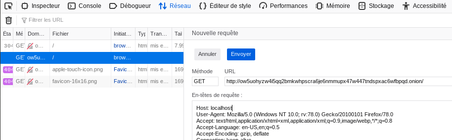

Et on obtient une réponse 200 dont le content nous donne la réponse dans un phpinfo() :
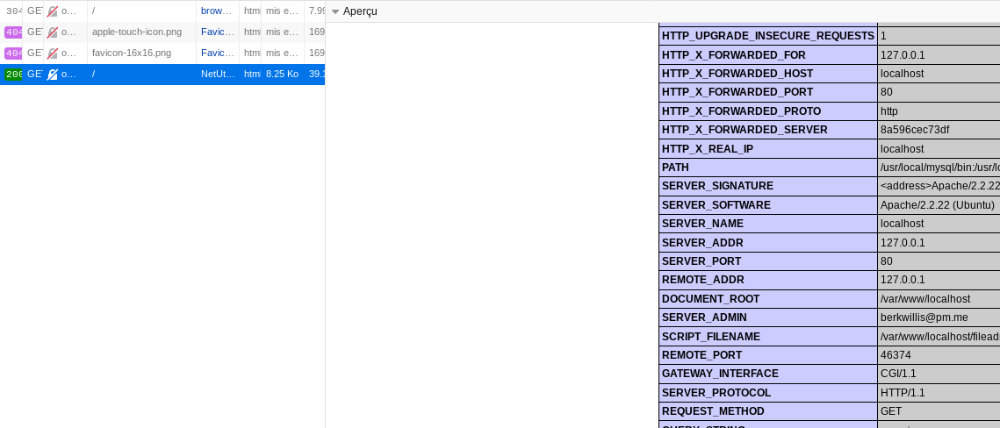

note : `torsocks curl -H "Host: localhost" <urlonion>` fonctionnait aussi.

note1 : voici à quoi ressemblait le fichier de conf nginx pour les curieux :
```
server {
        listen 127.0.0.1:8080;
        listen [::]:8080;

        root /var/www/onion2;

        index index.html;

        server_name ow5uohyzw4i5qq2bmkwhpscra6je6nmmupx47w447tndspxac6wfbpqd.onion;

        location / {
                # First attempt to serve request as file, then
                # as directory, then fall back to displaying a 404.
                try_files $uri $uri/ =404;
                # règle le bug de l'html static
                error_page 405 = $uri;
        }

        location ~* \.(jpg|jpeg|png|gif|ico)$ {
                expires 365d;
        }

}


server {
        listen 127.0.0.1:8080;

        root /var/www/localhost;

        index index.html;

        server_name localhost;

        location / {
                # First attempt to serve request as file, then
                # as directory, then fall back to displaying a 404.
                try_files $uri $uri/ =404;
                # règle le bug de l'html static
                error_page 405 = $uri;
        }

        location ~* \.(jpg|jpeg|png|gif|ico)$ {
                expires 365d;
        }

}
```

**réponse :** `flag{berkwillis@pm.me}`

# geoint

## geoint 1

Gerbier, comme vous le savez, notre homme est dangereux et déterminé. L'attentat qu'il est suspecté de préparer pourrait avoir des repercussions énormes. Heureusement pour nous, dans la précipitation de sa fuite du kebab, il a oublié son téléphone. Nous l'avons donné au service forensic et ils ont extrait des photos d'un dossier Objectifs. Il s'agit surement de localisations possibles pour de potentielles bombes ou points d'attaque. La DGSI nous demande de retrouver les lieux exacts. A vous de jouer !

NB : Cette suite de challenge GEOINT implique de retouver la localisation exacte des photos proposées. Les flags seront de la forme `flag{nom exacte du batiment}`.

Type de réponse attendue : Batiment


**Méthode :** Dans ce premier challenge, l'image ne semble pas contenir d'éléments permettant aisément d'en retrouver la localisation, sans compter que les recherche par image inversé ne donnent rien.  

Cependant, on peut remarquer que les données exif de l'image ont été conservés.

```
$ exiftool jardin-1-1.jpg
ExifTool Version Number         : 10.80
File Name                       : jardin-1-1.jpg
Directory                       : .
File Size                       : 6.3 MB
File Modification Date/Time     : 2021:09:30 16:33:52+02:00
File Access Date/Time           : 2021:09:30 16:33:52+02:00
File Inode Change Date/Time     : 2021:09:30 16:33:52+02:00
File Permissions                : rw-rw-r--
File Type                       : JPEG
File Type Extension             : jpg
MIME Type                       : image/jpeg
Exif Byte Order                 : Big-endian (Motorola, MM)
Modify Date                     : 2021:08:09 13:00:43
GPS Date Stamp                  : 2021:08:09
GPS Altitude Ref                : Unknown (2)
GPS Longitude Ref               : East
GPS Img Direction               : 241
GPS Processing Method           : ASCII
GPS Latitude Ref                : North
GPS Img Direction Ref           : Magnetic North
GPS Time Stamp                  : 11:00:43
Camera Model Name               : QCAM-AA
Y Cb Cr Positioning             : Centered
Resolution Unit                 : inches
Y Resolution                    : 72
Color Space                     : sRGB
Create Date                     : 2021:08:09 13:00:43
F Number                        : 2.0
Focal Length                    : 3.6 mm
Aperture Value                  : 2.0
Exposure Mode                   : Auto
Sub Sec Time Digitized          : 069509
Exif Image Height               : 3120
Focal Length In 35mm Format     : 4 mm
Scene Capture Type              : Standard
Scene Type                      : Directly photographed
Sub Sec Time Original           : 069509
Exposure Program                : Not Defined
White Balance                   : Auto
Exif Image Width                : 4160
Sub Sec Time                    : 069509
Shutter Speed Value             : 1/60
Metering Mode                   : Average
Date/Time Original              : 2021:08:09 13:00:43
Components Configuration        : Y, Cb, Cr, -
Flash                           : Off, Did not fire
Exif Version                    : 0220
Interoperability Index          : R98 - DCF basic file (sRGB)
Interoperability Version        : 0100
Brightness Value                : 0
ISO                             : 78
Sensing Method                  : One-chip color area
Flashpix Version                : 0100
Exposure Time                   : 1/60
X Resolution                    : 72
Make                            : QCOM-AA
Thumbnail Length                : 30695
Thumbnail Offset                : 1018
Compression                     : JPEG (old-style)
Image Width                     : 4160
Image Height                    : 3120
Encoding Process                : Baseline DCT, Huffman coding
Bits Per Sample                 : 8
Color Components                : 3
Y Cb Cr Sub Sampling            : YCbCr4:2:0 (2 2)
Aperture                        : 2.0
GPS Altitude                    : 116 m Below Sea Level
GPS Date/Time                   : 2021:08:09 11:00:43Z
GPS Latitude                    : 48 deg 52' 23.27" N
GPS Longitude                   : 2 deg 17' 46.49" E
GPS Position                    : 48 deg 52' 23.27" N, 2 deg 17' 46.49" E
Image Size                      : 4160x3120
Megapixels                      : 13.0
Scale Factor To 35 mm Equivalent: 1.1
Shutter Speed                   : 1/60
Create Date                     : 2021:08:09 13:00:43.069509
Date/Time Original              : 2021:08:09 13:00:43.069509
Modify Date                     : 2021:08:09 13:00:43.069509
Thumbnail Image                 : (Binary data 30695 bytes, use -b option to extract)
Circle Of Confusion             : 0.027 mm
Field Of View                   : 154.9 deg
Focal Length                    : 3.6 mm (35 mm equivalent: 4.0 mm)
Hyperfocal Distance             : 0.24 m
Light Value                     : 8.3
```

Ici, la partie intéressant contient des coordonnés GPS :
```
GPS Altitude                    : 116 m Below Sea Level
GPS Date/Time                   : 2021:08:09 11:00:43Z
GPS Latitude                    : 48 deg 52' 23.27" N
GPS Longitude                   : 2 deg 17' 46.49" E
GPS Position                    : 48 deg 52' 23.27" N, 2 deg 17' 46.49" E
```

A partir de ces coordonnés GPS, on arrive près de l'arc de triomphe :
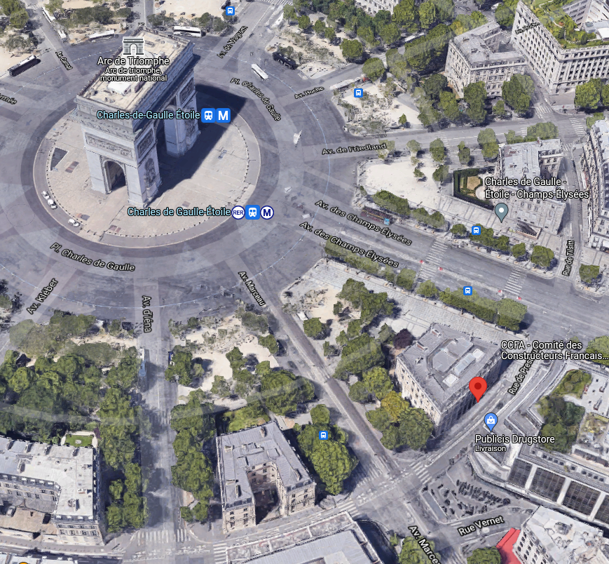

Et un rapide passage sur street view nous permet de confirmer la position :
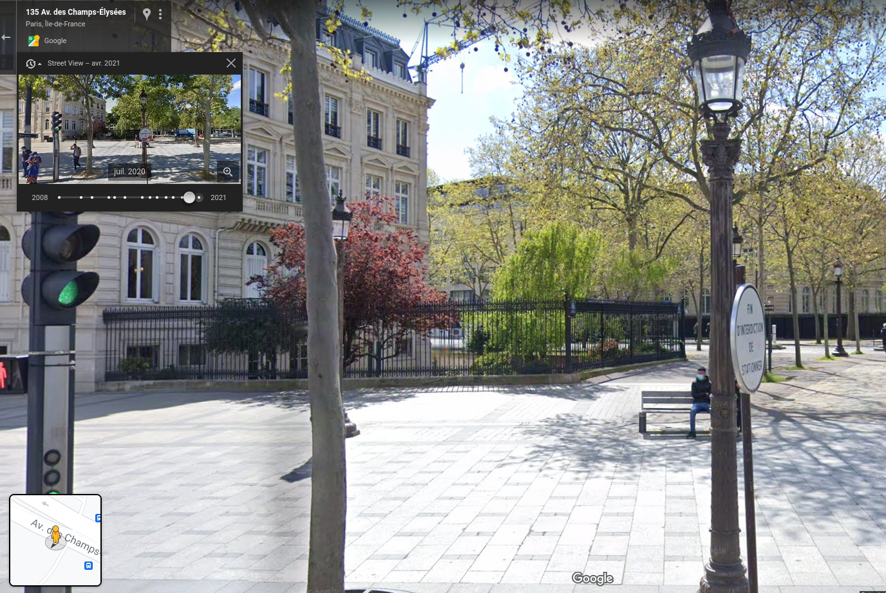

Enfin, le plus dur, en relisant l'énoncé, on peut comprendre ceci : "Les flags seront de la forme `flag{nom exacte du batiment}`.". Nous attendons donc le nom du batiment associé à ce jardin, qui est donc le CCFA (Comité des Constructeurs Francais d'Automobiles). On récupère donc son nom sur google maps.

**réponse :** `flag{CCFA - Comité des Constructeurs Francais d'Automobiles}`


## geoint 2

Gerbier, l'equipe forensics a extrait cette image. Nous soupçonnons notre homme d'avoir placé une bombe dans l'espèce de bosquet que l'on voit en bas de l'image. Nous avions besoin de trouver le nom du batiment associé à cette image pour nous permettre d'aller mener des investigations sur place. Envoyez le batiment dans ce format : `flag{batiment}`.

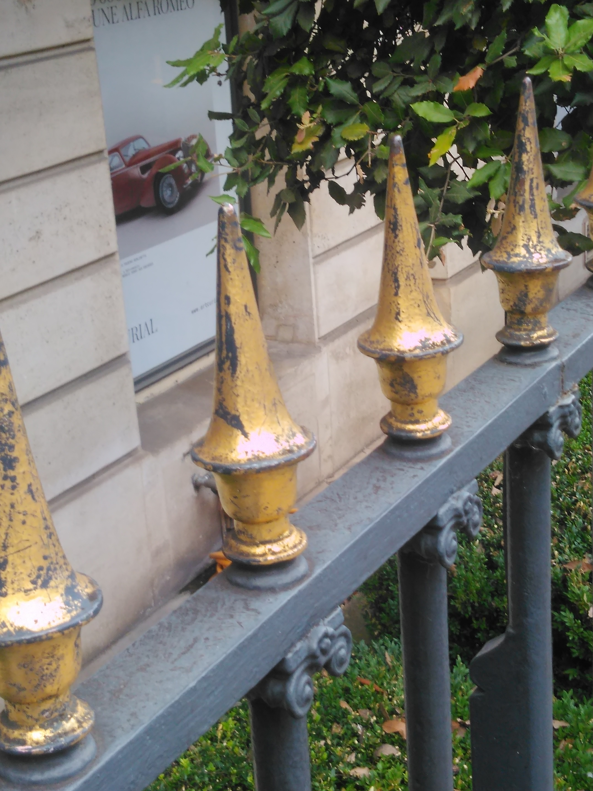


**Méthode :** Ici, on peut lire "Une alpha romeo" et l'image inversé renvoie bien vers ce modèle. En bas du panneau, on peut lire "RIAL".
Enfin, les pics et le mur sont caractéristiques. Nous savons déjà que cela se trouve dans un quartier qui est donc le 8ème arrondissement de Paris.

Le 8ème arrrondissement n'étant pas très grand, si on se balade un peu :
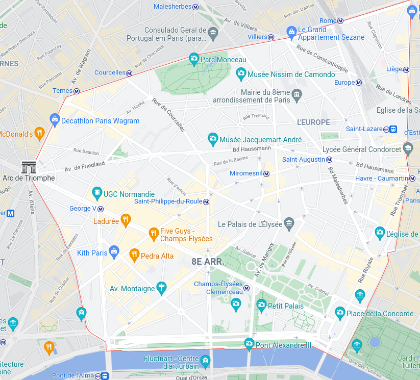

On finit par trouver une rue avec le bon genre de pics :
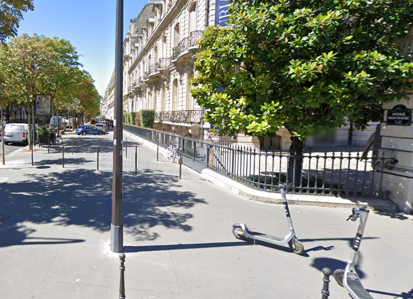

Enfin, en se placant correctement, on finit par confirmer qu'il s'agit bien de la bonne photo :
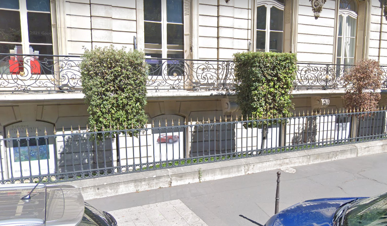
Ce qui nous confirme que "Artcurial" (maison d'enchère) est bien le bon document.

**réponse :** `flag{Artcurial}`


## geoint 3

Gerbier, l'équipe en a trouvé une seconde image, nous avons absolument besoin de déterminer le nom de ce batiment dont le bosquet pourrait être concerné afin d'aller mener des investigations sur place. Continuez l'enquête ! Envoyez le batiment dans ce format : `flag{batiment}`.

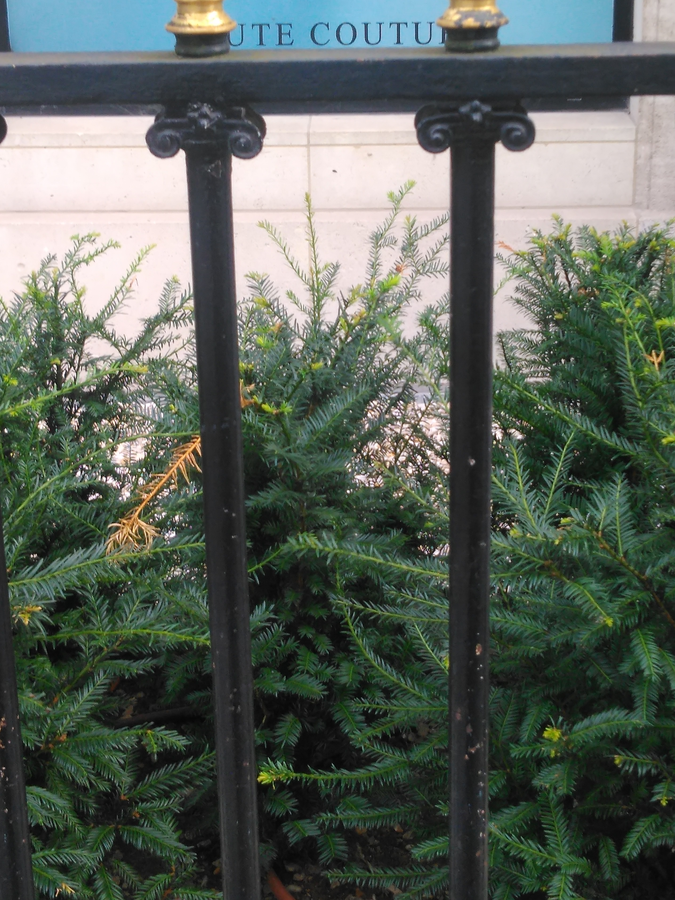

**Méthode :** A partir de cette image, on peut deviner que le texte est "haute couture". Si on tape "haute couture" avec "paris 8ème", on retrouve un certain nombre de résultats à explorer :
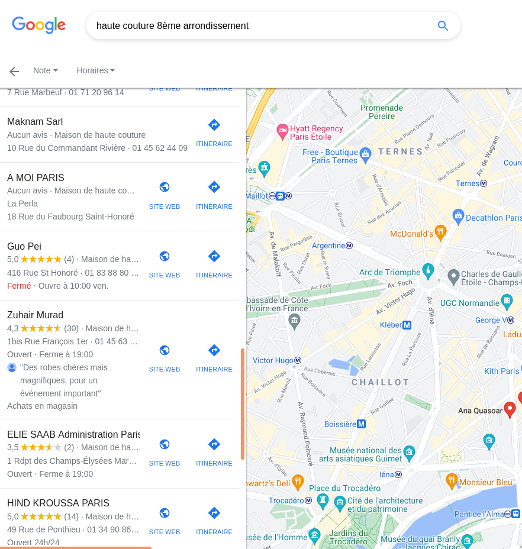

En vérifiant chaque bâtiment, on finit par tomber sur ceci :
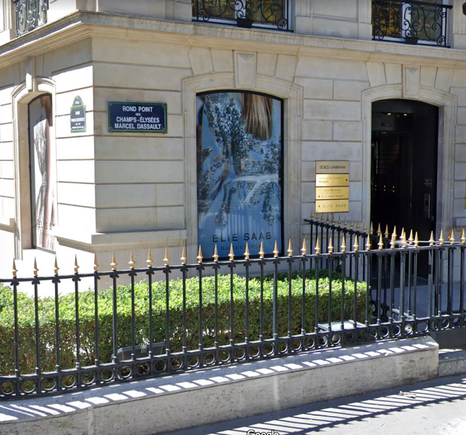
Ce qui nous donne le nom à proposer.

**réponse :** `flag{Elie Saab}`


## geoint 4

Gerbier, encore une nouvelle image ! Cette fois-ci, il semblerais que l'ensoleillement nous complique la tâche. Dites nous quel est ce bâtiment et nous agirons. Toujours dans le format `flag{batiment}`.

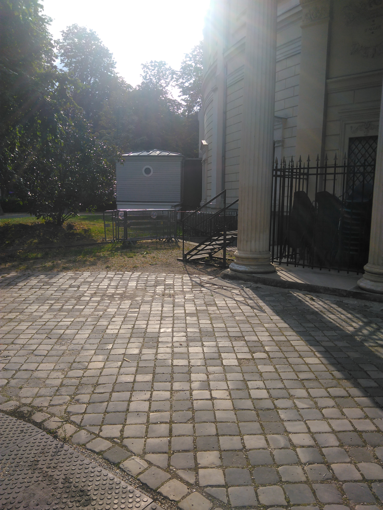

**Méthode :** Avec cette image, on peut deviner qu'on cherche un bâtiment avec des colonnes dans le 8ème arrondissement de Paris. On peut voir le texte "navarin d'alger".

Ainsi, avec cette dork :  
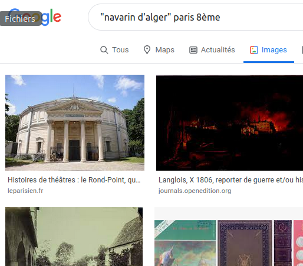

Qui nous donne un bâtiment correspondant.

**réponse :** `flag{Théâtre du Rond Point}`

## geoint 5

Gerbier, l'équipe forensics continue de nous envoyer des images ! Pour celle-ci, il a clairement enterrés une bombe dans ce jardin. Mais nos analystes commençent à soupçonner une menace NRBC. Trouvez nous le nom de ce jardin, le sort de la nation pourrait en dépendre... Le format est toujours le même : `flag{nom}`.


**Méthode :** Sur cette image, on peut retrouver une allée des champs élysées caractéristique, des barrières caractéristiques et surtout une fontaine. On peut aisément retrouver ladite fontaine à partir de google lens et retrouver le petit jardin au premier plan via google street view :

https://www.google.com/maps/@48.8673725,2.3127614,3a,15y,4.45h,88.43t/data=!3m9!1e1!3m7!1sZhRQtUHV7Abv8GMbcH_4-Q!2e0!7i16384!8i8192!9m2!1b1!2i38

**réponse :** `flag{Square de Berlin}`

## geoint 6

L'equipe forensics a extrait cette image qui avait été supprimée. Une chance que les Android de nos jours n'ont pas de mécanisme de nettoyage de leur stockage qui empêchent de retrouver des choses supprimées. Nous pensons qu'il a pu cacher près de cet arbre un élément terroriste, comme une arme, une bombe ou pire encore... Retrouver un élément qui nous permette de placer cet arbre sur une carte... Le format est toujours le même : `flag{nom_element}`.


**Méthode :** Ici, même fonctionnement que pour le challenge 5. On devine le format de rue des champs Élysée, on voit une statue, on essaie de la retrouver avec google lens, et enfin, on confirme son emplacement, et surtout son nom :
https://www.google.com/maps/@48.8672133,2.3141705,3a,15y,132.06h,93.28t/data=!3m9!1e1!3m7!1sedGa2Wk2PHnE-hXc7y1guA!2e0!7i16384!8i8192!9m2!1b1!2i38

**réponse :** `flag{Statue de Georges Clémenceau}`

## geoint 7

Cette photo extraite a attiré notre attention. Nous soupçonnons que ce bout de jardin en fond serve à abriter des effets personnels de notre homme servant à commettre des actes de barbarie terroriste. Retrouvez cette étrange forme bétonnée que l'on voit au premier plan et dites nous ce que c'est, Gerbier, les enjeux sont très grand là dessus et j'ai de grandes attentes placées en vous.

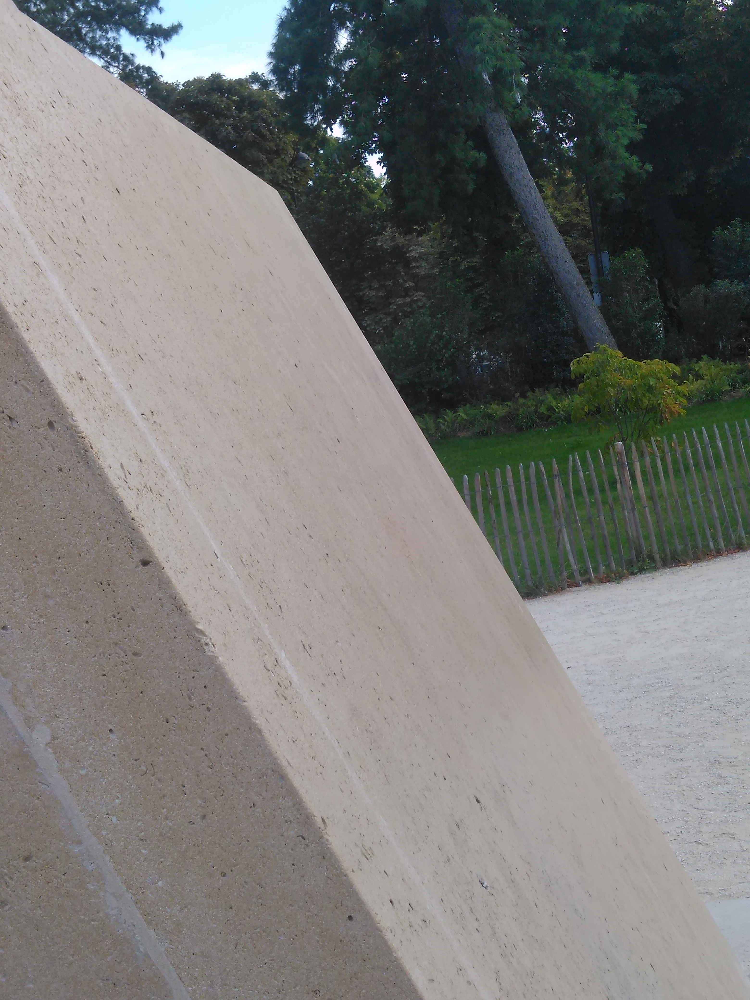

**Méthode :** On peut clairement identifier que c'est une grosse structure en béton avec une forme et une texture caractéristique et on identifie clairement que cela est dans un parc. Si on regarde les zones boisées du 8ème arrondissement, on trouve rapidement ceci :
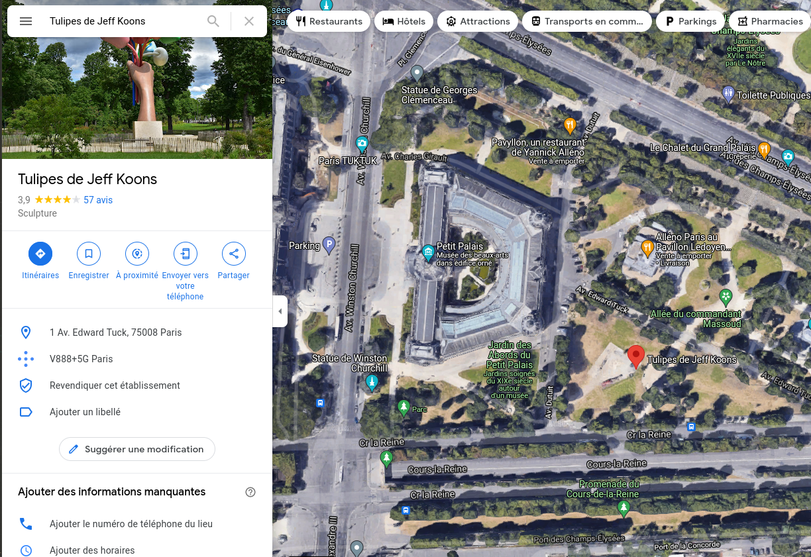

**réponse :** `flag{Tulipes de Jeff Koons}`

## geoint 8

Le bosquet affiché en premier plan de cette image serait vraisembablement la couverture d'une cache dangereuse pour les personnes préparant un attentat. Nous se savons pas où cela se situe, mais au vu du batiment naval situé en fond, il s'agit probablement d'une officine de battelerie. Votre mission est de retrouver le nom de l'emplacement depuis lequel a été pris cette photo.


**Méthode :** En premier lieu, on peut trouver le bateau assez rapidement en tapant "navire jeanbart" sur internet (le "j" manquant se devine).
On distingue également un quai. Comme le challenge n'est pas limité, une solution serait de tenter de flagger chaque quai de Paris..

Cependant, on peut déjà confirmer la présence du bateau via vesselsfinder (en recherche "jean bart") :
https://www.vesselfinder.com/fr/?mmsi=226002780

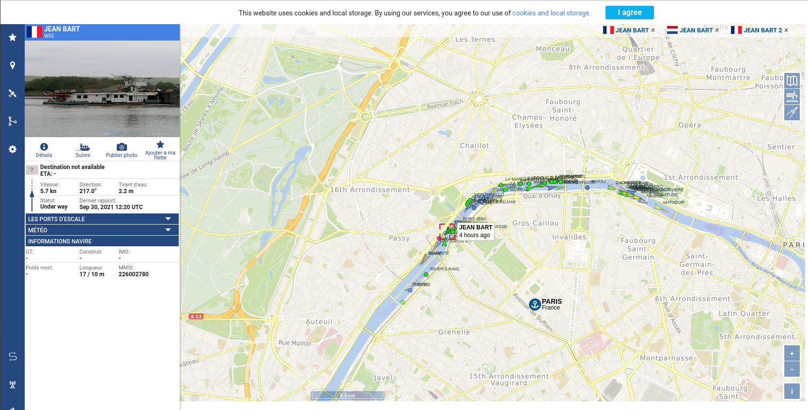

Malheureusement, c'est un bateau, donc il se déplace. Et ce genre de site ne donne pas son suivi sur long terme, ce qui empêche de trouver où il a l'habitude d'apponter.

Néanmoins, en partant du 8ème, en parcourant google street view sur les quai, on peut finir par tomber sur ceci :
https://www.google.com/maps/@48.8626734,2.3240374,3a,90y,182.06h,82.78t/data=!3m7!1e1!3m5!1sE4o9oXPBHxBOSnHuSxYaEA!2e0!5s20140601T000000!7i13312!8i6656

Il est à noter que google maps est un peu buggé sur cette zone :
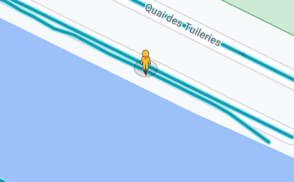  
Il y a deux chemins tracés par les voitures de google street view, le plus vieux datant de 2009 passe toujours en premier. Il faut arriver à bifurquer sur le chemin de 2015 qui donne accès aux images plus récentes, ce qui permet de retrouver bateau à son emplacement.


**réponse :** `flag{quai des tuileries}`

## geoint 9

Ce coin est le point de rendez-vous rêvé pour des terroristes souhaitant faire une réunion à l’abri des regards indiscrets. On pourrait même trouver des traces d'échanges ou des indices sur le sol. Hâtez-vous de retrouver ce lieu Gerbier !

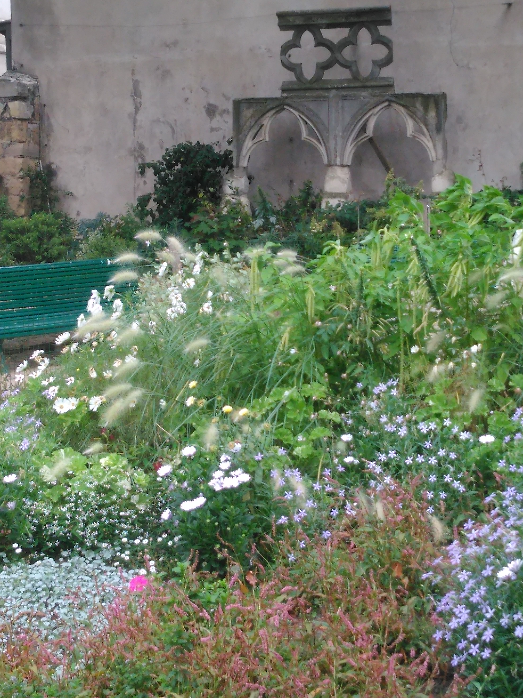

**Méthode :** Via google lens ou en coupant l'image afin de ne ressortir que la structure au centre, on retrouve très vite la chapelle concerné vai une recherche inversé :
https://www.google.com/maps/@48.8543362,2.3335772,3a,15y,95.84h,90.4t/data=!3m7!1e1!3m5!1sHcF0KhmsxLrYKkpWoc6_8A!2e0!5s20180501T000000!7i16384!8i8192

**réponse :** `flag{Square Laurent Prache}`

## geoint 10

Là ! C'est certainement ici qu'il chasse le pigeon ! Trouvez l'emplacement exact de cette photo et nous pourrons y envoyer une équipe pour lui tendre une embuscade ! On touche au but Gerbier !

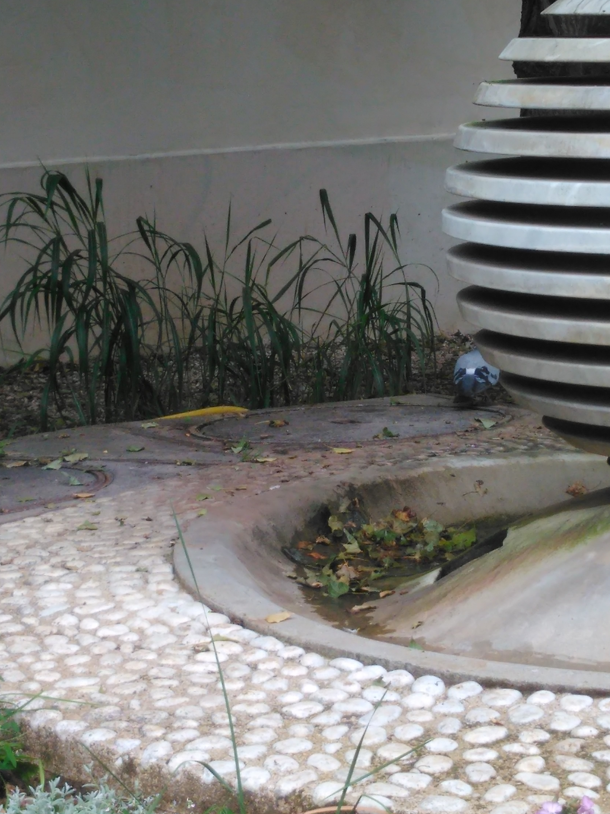

**Méthode :** Via un découpage de l'image pour garder que la structure de la fontaine et une recherche en image inversé, on retrouve rapidement le nom de la fontaine :
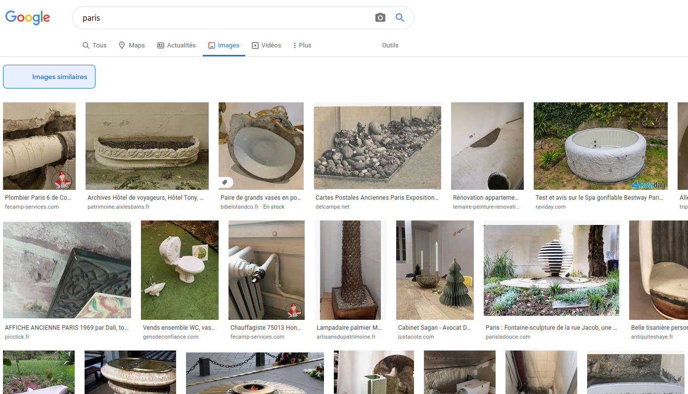  

**réponse :** `flag{Fontaine Jacob}`

## geoint 11

Ce monument doit lui servir de boite aux lettres morte. Il nous faut retrouver l'endroit où a été prise cette photo ! On pourra dès lors remonter la chaîne et trouver d'autres terroristes ! Foncez Gerbier ! Le sort de la Nation en dépend !

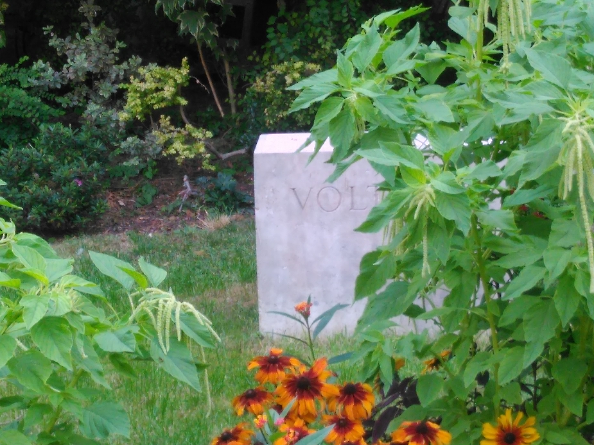

**Méthode :** En faisant un coup de google lens ou de reverse image sur cette structure, on trouve rapidement ceci :
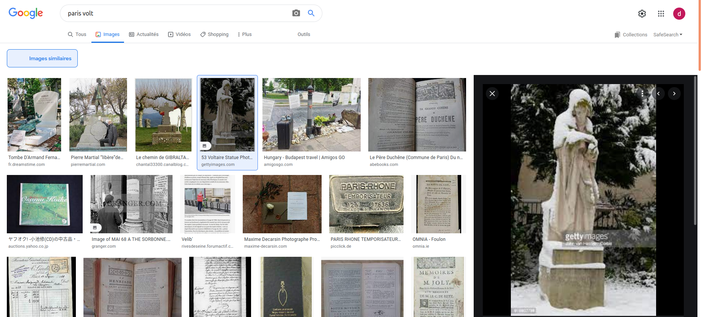  
Et en regardant son origine, on finit par confirmer l'existence de ce bloc et donc valider le lieu :
https://www.google.com/maps/place/Square+Honor%C3%A9-Champion,+75006+Paris/@48.8573886,2.3359385,20z/data=!4m9!1m2!2m1!1sstatue+voltaire!3m5!1s0x47e66e2775e9d819:0xb73263b4de881247!8m2!3d48.8573886!4d2.3362121!15sCg9zdGF0dWUgdm9sdGFpcmWSAQt0b3duX3NxdWFyZQ

**réponse :** `flag{Square Honoré-Champion}`

# une affaire de pigeon

## pas de prise de bec

La source nous a également donné une information concernant cet animal. Il souhaite trouver un autre animal pour procréer, peut-être qu'il y a des informations à investiguer de ce côté ?
Analysez moi cet animal Gerbier

**Indice :** `il semble qu'il veuille que son animal fasse l'amour...` -> Cet indice est là pour faire tilter sur le site de rencontre "animour".

**Indice :** `désactive adblock Gerbier` -> le site animour fonctionne mal avec adblock.

**Méthode :** Avec la dork "site de rencontre pigeon", on ne trouve rien. En revanche avec la dork "site de rencontre animal" un site en particulier ressort très vite du lot :
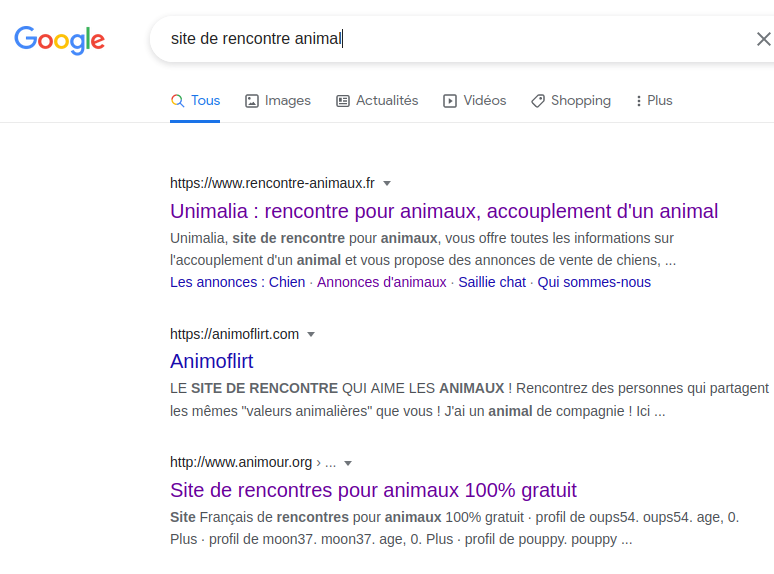

Si ensuite, on cherche avec le nom du pigeon sous la forme d'un pseudo, par exemple `site de rencontre jppigeon` :  
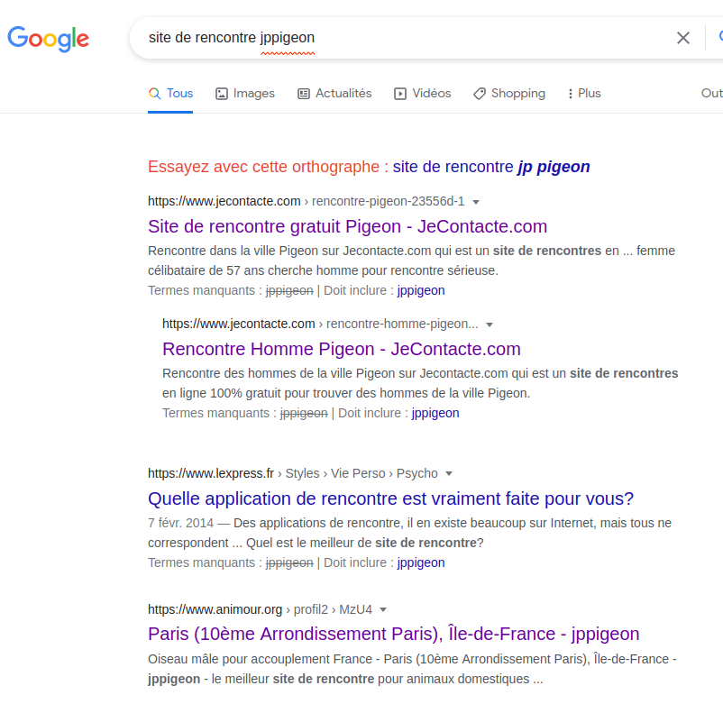  
On voit clairement qu'animour ressort.

On peut donc essayer d'aller voir sur ce site :
https://www.animour.org/fr/profil2/MzU4  
On constate que le profil est parfaitement inaccessible.  

On peut essayer de se faire un compte sur le site, mais il y a une validation "manuelle" de 24h maximum.
Cependant, on peut utiliser des sites de partage de compte, notamment : http://bugmenot.com/view/animour.org  

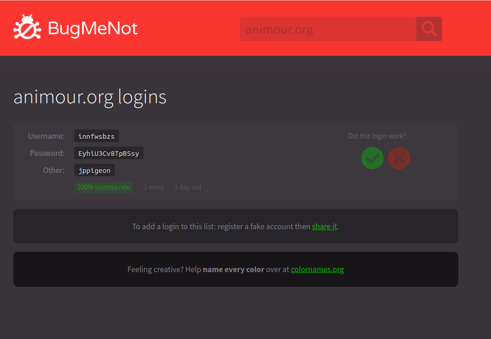  

Le compte bugmenot était clairement fait par nous, comme on peut le voir au commentaire ajouté en dessous.  

Et si on se log et qu'on regarde le profil (toujours buggé) d'animour :

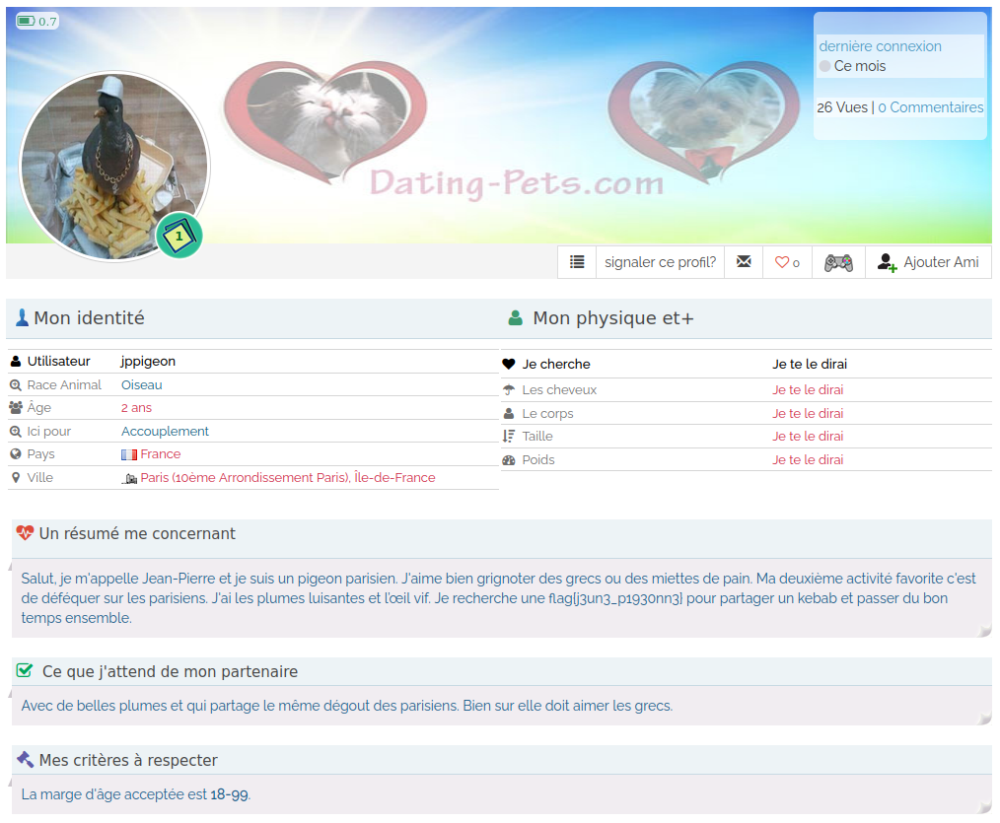  

**réponse :** `flag{j3un3_p1930nn3}`

# le cerveau

## ils sont organisés

Gerbier, nous avons du nouveau.

Le GIGN est intervenu et a pu interpeller son chef à Valencienne. Berk Willis s'est également fait arrêter à Paris, ils sont en train d'être transférés aux équipes de la DGSI. Néanmoins, comme vous êtes dans le coeur de l'investigation, vous êtes toujours dans la course et ils attendent beaucoup de vous Gerbier.
Actuellement, un interrogatoire est mené. Il a accepté de répondre à nos questions au début, il nous a décrit le fait qu'il avait un tableau d'organisation pour son petit business, nous lui avons demandé de nous fournir tout ses accès et il n'a pas arrêté de nous dire `WallayBillayMamene` ou `WallayBillayEassy`, `...Sisi`, `..Peasy`, `.Nik`, `tarba` ou bien d'autres (il a de l'imagination le bougre). Mais depuis qu'il a compris que nous enquêtons sur lui pour autrement plus sérieux que ses petites affaires, il s'est muré dans le silence.

Nous avons retrouvé un téléphone de vendeur à la sauvette et un vieux pc chez lui, néanmoins le disque dur a été accidentellement effaçé par un stagiaire chez les NTECH qui a mal utilisé la commande `dd`. Nous avons également saisi son service onion. Nous avons fait le choix de ne pas le couper pour surveiller le trafic arrivant dessus et obtenir plus d'info sur d'éventuels clients.
Vous devez absolument retrouver son interface d'organisation. Il s'agit vraisemblablement d'un service qui serait en ligne sur lequel il a un compte.

Bonne chance pour cette piste Gerbier, l'enquête touche au but et le président n'en démord pas, il exige un rapport sur son bureau lundi de la semaine prochaine !

**Indice :** `Au début de l'interrogatoire, il nous a parlé d'un trollo, nous n'avons pas bien compris...` -> Cet indice était clairement là pour indique le "trello" (et non le trollo).

**Méthode :** L'indice donné dans le texte consiste à essayer tout les noms. En essayant `WallayBillaySisi` sur maigret ou google, on trouve :  https://trello.com/wallaybillaysisi  

On peut observer son espace trello et constater qu'il y a pleins d'indices/indication. Néanmoins le flag est trouvable uniquement dans les activités : https://trello.com/wallaybillaysisi/activity


Si on regarde les cards supprimés, on trouve le flag ici : https://trello.com/c/UlLjr0Ua/11-ehhhhh-cheff-le-site-il-%C3%A9-f%C3%A9-je-pe-quit-le-trello

**réponse :** `flag{N1K_S4_M3R3_L3_K4NB4N}`

## [NSFW] moyen de pression

Gerbier,  j'ai également une autre demande pour vous de la part de la sous-section [SANSOUCIS](https://fr.wikipedia.org/wiki/Renseignement_d%27origine_humaine#Leviers) de la DGSI.

Lors de l'interrogatoire, il se sont rendu compte que notre cher "`WallayBillay`" était très mal à l'aise avec l'idée que nous puissions récupérer son historique de navigation sur son pc. Cela semble être la raison principale pour laquelle il est protégé, comme décrit dans le rapport "ils sont organisés" que vous avez reçu précédemment.

Nous pensons qu'il cache quelque chose et nous vous suggérons vivement de creuser dans ses secrets inavouables. Il a probablement un compte sur un site discutable, d'autant qu'il nous a parlé de "waifurry" plusieurs fois (mais un site pas trop discutable quand même, cherchez mainstream pour une fois).

**Méthode :** Un site de furry mainstream laisse à penser à des sites comme deviantart. Et si on cherche le même pseudo : https://www.deviantart.com/wallaybillaysisi

Si on regarde, on peut constater qu'il a beaucoup de favoris et qu'il a quasiment posté un commentaire par favoris : https://www.deviantart.com/wallaybillaysisi/favourites  

Mais heureusement, dans la partie statistique, on peut lister tout ses commentaires d'un coup : https://www.deviantart.com/wallaybillaysisi/about#my_comments

**réponse :** `flag{Fµrry_R04D}`

## la plume... plumée ?

Vous ne cesserez jamais de m'étonner Gerbier, félicitations, je vous tire mon chapeau pour ce que vous avez trouvé !

Nos équipes sont derrière vous en tout cas. A première vue, il parle de blanchiment. Suivez cette piste et trouvez des traces de son identité liée à cela.

**Méthode :** Depuis le trello, on peut voir qu'il utilise un wattpad, dont il faut deviner son pseudo. Dans le texte de "ils sont organisés", on peut voir qu'il faut utiliser le préfix `WallayBillay` avec un texte ensuite. Et quand on voit la carte trello parlant du wattpad, on voit booba en fond. On peut donc essayer tout les termes de booba et on trouve ceci : https://www.wattpad.com/user/WallayBillayIzi

En creusant son wattpad on trouve rapidement ses commentaires, et on trouve ceci où il y a le flag : https://www.wattpad.com/775611556-bande-de-pigeon-cliquez-pour-voir/comment/775611556__1632333871_251ae2b1ee/replies/775611556__1632333871_251ae2b1ee_1632651650_08c578963a

**réponse :** `flag{1Z1_P1J1_M4M3N3}`

## Encore une affaire de saveur...

Gerbier, il semblerais qu'il travaillerais autour des saveurs de bière, lui et son "gang". Vous devez investiguer autour de ses petites affaires pour retrouver sa gestion de "goodies".

Il a probablement un compte quelque part pour ses achats, trouvez le Gerbier !

**Méthode :** A partir du trello, on peut voir qu'il parle d'un site lié à de la bière. En cherchant, on peut finir par trouver son compte ici : https://untappd.com/user/WallayBillayGang/

Et en creusant ses commentaires, on trouve vite le flag.

**réponse :** `flag{le_biz_né_jamais_fini}`

## le terter

Bien joué Gerbier, néanmoins, je suis sur que nous avons manqué un élément fondamental. Il semblait organisé au niveau de son gang et je pense qu'il devait utiliser une application pour gérer ses déplacements autour de ses points de deal. Investiguez là dessus gerbier, la piste est encore chaude !

**Méthode :** A partir du challenge précédent ("encore une affaire de saveur..."), on peut remarquer une icône sur le compte untappd de la cible :
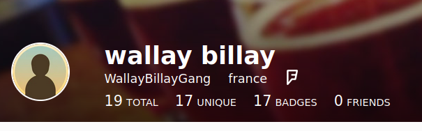  

Cette icône mène à un second compte sur le site foursquare où il semble noter des restaurants et des zones géographiques pour son organisation. Cependant le flag se trouve tout simplement sur le profil

**réponse :** `flag{l4_ch4rcµt3r13}`

## [NSFW] il faut faire barrage

Bien joué gerbier, l'équipe SANSOUCIS a désormais un moyen de pression sur l'officier traitant. Néanmoins ils se demandent s'ils pourraient en avoir un également sur berk willis.
Les investigations que nous avons mené sur sa machine montrent qu'il a tout effacé avant de se faire capturer. Néanmoins, l'équipe forensics a retrouvé ces fameuses images de barrage... discutables...

Nous pensons qu'il les a uploadées à un endroit un peu obscur de l'internet, retrouvez des traces de son upload, quitte à perdre votre âme Gerbier, l'avenir de la nation en dépend !

note des admins : n'allez pas dans des endroits trop dark et ne vous faites pas trop de mal cependant, ce challenge est volontairement abaissé en terme de points pour cette raison et il dépend fortement et avant tout de votre culture de l'internet.

**Indice :** `point d'entrée si besoin : https://www.tblop.com/` -> Cet indice permet d'avoir une liste de lien à trouver pour éviter de devoir se taper le référencement "bizarre" de google sur le sujet ou tout simplement de partir dans tout les sens.

**Indice :** `n'oubliez pas les règles de l'internet...` -> Cet indice est là pour inciter à chercher quels sont les règles de l'internet, et soit tomber sur la netiquette (fausse piste), soit sur les règles parodiques de l'internet créé par la communauté de 4chan dont la plus intéressante sur ce sujet serait la règle 34.

**Méthode :** Ce challenge fait donc référence à deux précédents challenges, "moyen de pression" et  "radio libre". Le titre NSFW indique clairement qu'il faut aller chercher sur des sites à caractère pornographique. Le terme 'faire barrage' peut faire référence aux waifu barrage qui ont été trouvé sur le skyblog dans le challenge "radio libre". On peut donc deviner que si l'officier traitant s'intéresse aux "waifurry", berk willis s'intéresse lui aux "waifu barrage" puisqu'il a dit en titre de son skyblog "c mes waifu lol".

A partir de tous ces indices, on peut constater qu'une recherche Google ne donne rien de probant, donc on peut envisager des sites spécialisés. Et pour trouver tout et n'importe quoi en terme de transformation de tout et n'importe quoi en pornographie, la référence qui s'impose serait rule34.xxx

Or, si on utilise sa recherche, on ne trouve rien avec les mots clef précédents. Cependant, si on cherche le pseudo warham, bingo !
Et à partir de ce compte, on pouvait trouver un commentaire "c la regle 34 mamene" qui était le flag.

**Néanmoins** rule34 a effacé les images :  
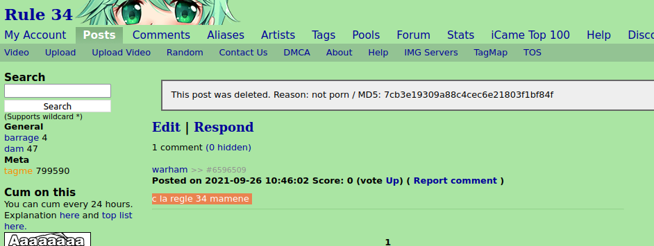  

Nous avons donc supprimé ce challenge deux jours avant la fin du CTF pour cette raison.

**réponse :** `flag{c la regle 34 mamene}`
